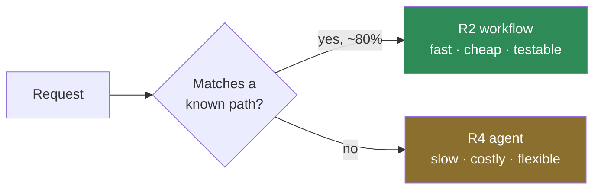

# The Autonomy Ladder

> **One line:** build the lowest rung that passes your acceptance test.

Most agentic projects fail by building rung 4 when rung 2 would have worked. Autonomy is not a virtue —
it is a cost you pay for capability you cannot get otherwise. This ladder makes the cost explicit.

---

## The six rungs

| Rung | Name | The model decides… | Typical calls/task | Failure you inherit |
| --- | --- | --- | --- | --- |
| **R0** | Script | Nothing. No model involved. | 0 | Only bugs |
| **R1** | Prompted call | The wording of one answer | 1 | Wrong answer |
| **R2** | Chained | Wording at each fixed step | 2–4 | Wrong answer, compounding |
| **R3** | Tool-choosing | *Which* tool, and with what arguments | 3–8 | Wrong tool, wrong arguments |
| **R4** | Planning | The sequence of steps, at runtime | 5–20 | Wrong plan; unbounded loops |
| **R5** | Self-directed | The goal decomposition itself | 10–100+ | Everything above, plus drift |

Each rung inherits every failure mode below it. That is the part people skip when they estimate.

## The promotion test

You may climb a rung only if you can answer **yes** to its question:

| To reach | You must be able to say |
| --- | --- |
| R1 | "The output is language, and its exact wording varies." |
| R2 | "The steps are fixed, and I can name them all right now." |
| R3 | "I cannot know which tool is needed until I see the input." |
| R4 | "I cannot know the *sequence* until I see what the tools return." |
| R5 | "I cannot enumerate the sub-goals, and a human could not either." |

If you hesitate on a rung's question, you are on the rung below it. Build there.

> **The R3/R4 line is where most money is lost.** R3 is a loop with a tool menu. R4 is a planner. Teams
> reach for R4 because it sounds more capable, then spend weeks constraining it back down into R3
> behaviour with prompt engineering. Start at R3.

## Descending is a legitimate move

If your agent is at R4 and 80% of traffic follows three known paths, you do not have an R4 problem. You
have three R2 workflows and an R4 fallback. Route to the cheap thing first.

This one pattern is the single largest cost reduction available to most deployed agents.

## Scoring your build

| Question | Score |
| --- | --- |
| Which rung does your acceptance test actually require? | R__ |
| Which rung did you build? | R__ |
| If they differ, what does the gap buy you? | ______ |
| What does the gap cost per 1,000 requests? | $_____ |

A gap with no answer in row 3 is a refactor waiting to happen.

## Where this shows up in the curriculum

- [Module 00](../../modules/00-agentic-foundations/) — the four-quadrant classifier is the R0–R3 decision
- [Module 05](../../modules/05-agent-loop-no-framework-to-strands/) — you build R3 by hand
- [Module 07](../../modules/07-strands-multi-agent-patterns/) — R4 and R5 topologies and their cost

**Related:** [Handoff Multiplier](handoff-multiplier.md) · [Token Tax Ledger](token-tax-ledger.md) ·
[Blast Radius Grid](blast-radius-grid.md)
