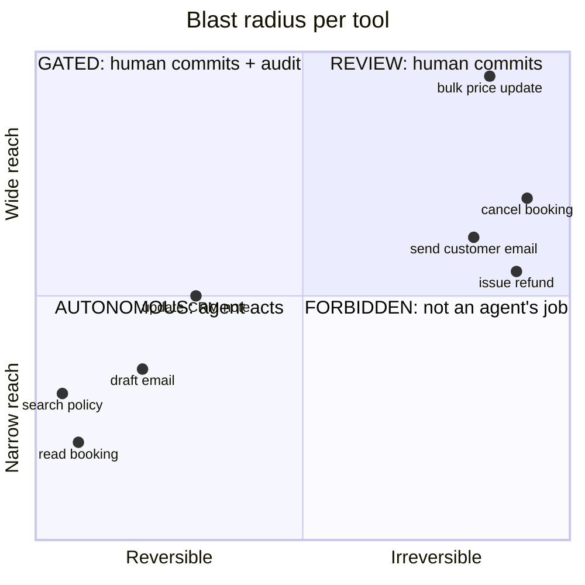

# The Blast Radius Grid

> **One line:** an agent may act autonomously only where mistakes are cheap and reversible — everywhere
> else it recommends and a human commits.

Permissions are usually decided by what is convenient to wire up. This grid decides them by what happens
when the agent is wrong, which is the only question that matters.

---

## The grid

Score every **tool** (not the agent — the tool) on two axes.

| Zone | Reversibility × Reach | Agent may | Example |
| --- | --- | --- | --- |
| 🟢 **Autonomous** | Reversible, narrow | Act freely | Read a record, search a corpus, draft text |
| 🟡 **Review** | Irreversible, narrow | Propose; human commits | Send one email, post one comment |
| 🟠 **Gated** | Reversible, wide | Act with audit + rate limit | Bulk tag, bulk enrich |
| 🔴 **Forbidden** | Irreversible, wide | Never | Bulk delete, mass send, move money |

## The two questions per tool

**Reversibility:** if this call was wrong, how long to undo, and does undoing need anyone's permission?

| Answer | Score |
| --- | --- |
| Undo is automatic, no trace | 0.0 |
| Undo is a one-line command by the on-call engineer | 0.3 |
| Undo needs a second system or a person's approval | 0.7 |
| Cannot be undone — money moved, message sent, data destroyed | 1.0 |

**Reach:** how many entities does one call touch?

| Answer | Score |
| --- | --- |
| One record, one user | 0.2 |
| A handful, one team | 0.5 |
| A whole tenant or customer segment | 0.8 |
| Everything | 1.0 |

## The design rule this produces

> **Keep every tool in the green zone by construction.**

That is not a constraint on ambition; it is a design technique. A refund agent does not need an
`issue_refund` tool. It needs `get_booking`, `get_fare_rules`, `search_policy` — all green — and it emits a
*recommendation*. A human commits. The agent is just as useful and cannot cost you a cent by being wrong.

When a red tool seems unavoidable, decompose it:

| Red tool | Green decomposition |
| --- | --- |
| `send_email` | `draft_email` + human send |
| `issue_refund` | `assess_eligibility` + queued approval |
| `cancel_booking` | `prepare_cancellation` + confirm step |
| `update_records(bulk)` | `propose_changes` + reviewed apply, rate-limited |

## The audit table

| Tool | Reversibility | Reach | Zone | Guard in place |
| --- | --- | --- | --- | --- |
| | | | | |

Any 🔴 row without a guard is your top-priority work item. Any 🟡 row where the "human commits" step is a
default-yes dialog is 🔴 in disguise.

## The IAM corollary

Blast radius should be enforced by **permissions**, not by the prompt. A prompt saying "never issue a
refund" is a suggestion. An IAM policy with no refund permission is a fact.

> If your only protection against a catastrophic action is text in a system prompt, you do not have
> protection. You have a hope.

## Where this shows up

- [Module 11](../../modules/11-bedrock-agentcore/) — identity scoped per tool
- [Module 11 LLD](../../docs/architecture/lld/11-bedrock-agentcore.md) — over-broad roles as the default mistake
- [Agent spec](../../docs/prd/02-agent-spec.md) — "no tool writes; every tool is a read"

**Related:** [Reversibility Test](reversibility-test.md) · [Tool Surface Audit](tool-surface-audit.md) ·
[Demo-to-Production Gap](demo-to-production-gap.md)
