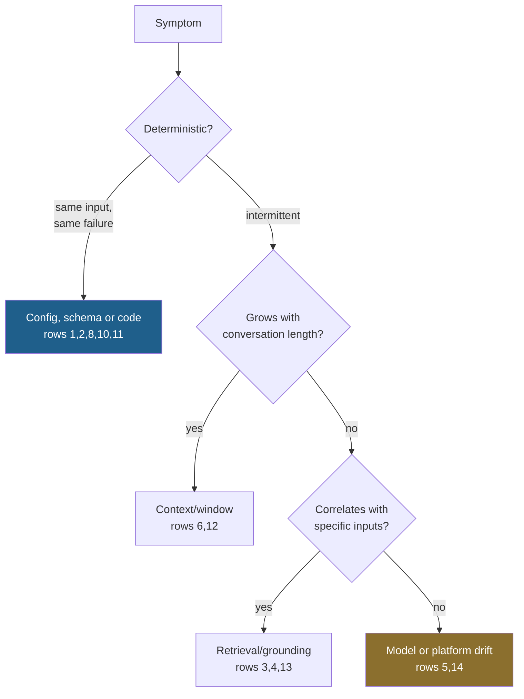

# The Failure Signature Catalog

> **One line:** every agent failure has a *shape* in the logs — learn the shapes and you stop guessing.

Debugging agents usually starts with re-reading the prompt. That is the slowest possible entry point. This
catalog maps observable signatures to likely causes, so you start from evidence.

---

## How to use it

Find the row that matches what you *observe*. Confirm with the check. Then fix.

| # | Signature (what you observe) | Likely cause | Confirm by | Fix |
| --- | --- | --- | --- | --- |
| 1 | Same tool called twice with identical args | Assistant tool-use turn missing from history | Print the message array before call 2 | Append both the assistant `toolUse` and the user `toolResult` turn |
| 2 | Answer ignores the tool result entirely | Tool result appended in the wrong role or shape | Inspect the last two messages | Match the provider's exact `toolResult` block shape |
| 3 | Plausible answer, empty citation array | Model answered from parametric memory | Assert citations on factual claims | Contract test; instruct abstention when retrieval is empty |
| 4 | Citations present but the passage does not support the claim | Citation theatre | Human-read 5 cited passages | Entailment check — see [Grounding Triangle](grounding-triangle.md) |
| 5 | Answer quality dropped, no code change | Model failover, or provider-side model update | Check which model answered | Pin the model; log it per response |
| 6 | Input tokens grow every turn until failure | Unbounded history buffer | Plot input tokens per turn | Cap or summarise at a threshold |
| 7 | Loop runs to max iterations then gives up | No convergence condition; tool never satisfies the model | Print the model's rationale per turn | Add a stop condition; check the tool actually answers the question asked |
| 8 | Wrong tool chosen for an obvious request | Tool description written for humans | Read the schema as the model receives it | Rewrite descriptions to disambiguate from neighbours |
| 9 | Correct sub-answers, wrong final answer | Context lost at handoff | Log what crosses each handoff | Pass explicit structured state, not prose |
| 10 | Works for you, fails for a colleague | Region, model access, or profile difference | Compare model IDs and regions | Pin region and inference profile in config |
| 11 | Intermittent `ValidationException` | Message roles not alternating | Dump roles as a sequence | Ensure user/assistant alternation |
| 12 | Fails only on long conversations | Context window overflow, silent truncation | Compare input tokens with the limit | Summarise; cap retrieval |
| 13 | Agent narrates a plausible answer after a tool error | Tool returned `{}` / `null` and the model filled the gap | Search logs for empty tool results | Make tools fail loudly; test tool-failure honesty |
| 14 | Cost per task jumped, quality unchanged | Turn count rose — topology or retry behaviour changed | Plot calls per task | Look at retries and delegation before blaming tokens |
| 15 | Guardrail blocks legitimate requests | Policy too broad | Review interventions for a day | Narrow the denied-topic definition |
| 16 | Agent refuses everything after a prompt edit | Instruction conflict — new rule contradicts an old one | Bisect the prompt diff | Version prompts; review them like code |

## The five-minute triage

Before opening the prompt, get these five facts:

1. **Which model answered?** (rules out #5)
2. **How many calls did the task take?** (rules out #7, #14)
3. **What were the input tokens on the last call?** (rules out #6, #12)
4. **Were any tool results empty?** (rules out #13)
5. **Were citations present and non-empty?** (rules out #3)

Four of these five are a single log line each. Adding them is the highest-return hour of instrumentation
work available on an agent.

## The debugging order that works

Start by asking whether it reproduces. Half the catalog is eliminated by that one question.

## Where this shows up

- [Troubleshooting guide](../../docs/setup/troubleshooting.md) — the AWS-specific version of this
- [Module 13 · debug walkthrough](../../modules/13-agentic-qa-and-evaluation/notebooks/debug_walkthrough.ipynb)
- Every [module LLD](../../docs/architecture/lld/) has its own failure-modes table

**Related:** [Silent Degradation Watchlist](silent-degradation-watchlist.md) ·
[Grounding Triangle](grounding-triangle.md) · [Three Clocks](three-clocks.md)

**Runnable:** [`agent_history_invariant.py`](https://gist.github.com/akash-coded/12cd36b5e5ced3e0c5414af3abffa221) — the two-line assertion that catches row 1 at the cause, with a demo of the bug and the fix.
