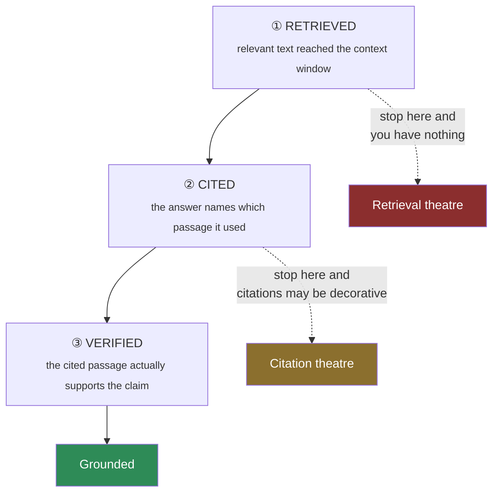

# The Grounding Triangle

> **One line:** retrieved, cited and verified are three different things, and most systems do one and
> claim all three.

"It's grounded, we use RAG" is the most common untrue statement in agentic AI. This framework separates
the three properties so you can say which ones you actually have.

---

## The three sides

| Side | Claim | Test | Usually implemented? |
| --- | --- | --- | --- |
| **Retrieved** | Relevant passages were placed in context | Log the passages; a human reads them | ✅ Almost always |
| **Cited** | The answer identifies which passage supports each claim | Assert a non-empty citation on every factual claim | ⚠️ Sometimes |
| **Verified** | The cited passage genuinely supports the claim | Entailment check, human sample, or judge model | 🔴 Rarely |

## Why each gap bites

**Retrieved but not cited.** The passages were there; you have no idea whether the model used them. It may
have answered from parametric memory and been right by luck. You cannot tell the difference, and neither
can your users.

**Cited but not verified.** The model names a passage. Models are good at naming a *plausible* passage for
an answer they generated independently. A citation is a claim about provenance, and claims need checking.

> This is the failure that survives review, because a cited answer *looks* grounded. It passes eyeballing.
> It fails entailment.

## The minimum viable implementation

You do not need all three at full strength on day one. You need to know which you have.

| Level | Implementation | Cost |
| --- | --- | --- |
| **L1** | Log retrieved passages with every response | ~free |
| **L2** | Contract test: factual claim ⇒ non-empty citation | ~free, blocks a build |
| **L3** | Human spot-check: 10 cited answers per release, does the passage support the claim? | 30 min/release |
| **L4** | Automated entailment check on the golden set | One extra call per case |
| **L5** | Entailment check on a production sample, continuously | Ongoing cost |

**Most teams should be at L3.** It is nearly free and catches the citation-theatre failure. Going straight
for L4 without L3 means you automate a check you have never manually validated.

## The one-question audit

> Pick a recent answer. Open the passage it cited. Does that passage, on its own, support the claim?

Do this five times. If you get fewer than five yesses, you have citation theatre, and no amount of retrieval
tuning will fix it — the problem is at the generation step.

## Anti-pattern: the confident synthesis

The model retrieves three passages, none of which answers the question, and synthesises a plausible answer
"informed by" them — then cites all three. Every side of the triangle appears satisfied. The answer is
invented.

**Detection:** the citation set is large (3+) and the claim is specific. Genuine grounding is usually
1–2 passages for a specific claim. Flag high-citation-count answers for review.

## Where this shows up

- [Module 04](../../modules/04-agent-builder-and-knowledge-bases/) — knowledge bases and citations
- [Module 10](../../modules/10-rag-opensearch-litellm/) — the full retrieval pipeline and its evaluation
- [Module 10 LLD](../../docs/architecture/lld/10-rag-opensearch-litellm.md) — failure modes

**Related:** [Abstention Budget](abstention-budget.md) · [Evidence Ladder](evidence-ladder.md) ·
[Failure Signature Catalog](failure-signature-catalog.md)
