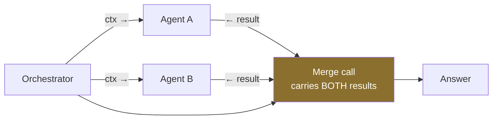

# The Handoff Multiplier (H×)

> **One line:** every handoff re-sends context, so topology is a cost decision before it is an
> architecture decision.

Multi-agent designs are chosen on diagrams and paid for in tokens. H× turns a topology into a number you
can put in a design document and defend at review.

---

## The number

```
H× = total_tokens(topology) ÷ total_tokens(single_agent_doing_the_same_task)
```

An H× of 3.4 means: this shape costs 3.4× a single agent. That may be entirely worth it. But you should
know the figure *before* the invoice tells you.

## Typical multipliers

Measured on comparable tasks. Yours will differ — measure, do not inherit these.

| Topology | H× (typical) | You are buying | You are paying for |
| --- | --- | --- | --- |
| Single agent | 1.0× | — | — |
| Delegation, 2 specialists | 1.8–2.6× | Focused context per specialist | Context re-sent per handoff |
| Delegation, 4 specialists | 3.0–4.5× | Sharper specialisation | Orchestrator overhead grows too |
| Critique / reflection, 1 round | 2.1–2.8× | Quality on ambiguous output | Double the generation |
| Critique, until-converged | 3–8×, unbounded | Higher ceiling | **Needs a hard round cap** |
| Graph, fixed path | 1.2–2.0× | Determinism, testability | Rigidity |
| Swarm, 3 agents | 4–12×, unbounded | Parallel exploration | **Needs a stop rule or it does not stop** |

## The three cost sources people forget

1. **Context re-transmission.** Each handoff re-sends the relevant context to the receiving agent. This is
   the dominant term, and it is invisible on an architecture diagram.
2. **Orchestrator overhead.** The orchestrator makes its own model calls to decide on each delegation.
   Four specialists means the orchestrator reasons four times.
3. **Merge cost.** Someone has to combine the outputs — and that call carries all of them in context.



The merge call is the one that surprises people. It is the most expensive single call in the topology.

## The justification test

Before adding an agent, answer all three:

1. **What does this agent know or do that the existing one cannot?** "It focuses better" is not an answer —
   that is a prompt problem, and splitting it multiplies the prompt problem.
2. **What is the H× delta, measured?** Not estimated.
3. **What is the stop condition?** For swarms and critique loops, an unbounded pattern is a budget leak
   with a diagram.

> **The rule that saves the most money:** adding agents does not fix a bad prompt. It runs the bad prompt
> N times.

## Reducing H× without changing topology

- **Trim what crosses the handoff.** Pass a summary and an id, not the full transcript.
- **Let specialists retrieve their own context** rather than the orchestrator carrying it for them.
- **Cap critique rounds at 1** and measure whether round 2 ever changed an outcome. Usually it does not.
- **Route around the topology** for known paths — see the [Autonomy Ladder](autonomy-ladder.md#descending-is-a-legitimate-move).

## Where this shows up

- [Module 07](../../modules/07-strands-multi-agent-patterns/) — all four topologies, measured
- [Graph vs swarm, head to head](../../modules/07-strands-multi-agent-patterns/notebooks/PierPoint_Release_Desk_Graph_vs_Swarm.ipynb)
- [Pattern selector workbook](../../modules/06-strands-foundations/activities/MultiAgent_Pattern_Selector.xlsx)

**Related:** [Token Tax Ledger](token-tax-ledger.md) · [Autonomy Ladder](autonomy-ladder.md) ·
[Cost Cliff Map](cost-cliff-map.md)
