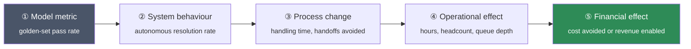

# The Value Trace

> **One line:** if you cannot draw an unbroken line from a model metric to money or time, you do not have
> a business case — you have an experiment.

For business analysts, PMs and anyone who has to justify the spend. Agent projects die at budget review
because the benefit is stated in model terms and the cost in dollars. This traces both to the same unit.

---

## The five links



Every link must be **stated, measurable and challengeable**. A broken link anywhere breaks the case.

## Where traces break

| Link | Common break | Fix |
| --- | --- | --- |
| ① → ② | Golden set does not resemble real traffic | Sample real inputs; see [Evidence Ladder](evidence-ladder.md) |
| ② → ③ | Agent resolves cases, but the process still routes everything to a human | Change the process, not just the software |
| ③ → ④ | Time saved per case is real, but spread too thin to reclaim | Aggregate — 30 s × 400/day is a person; 30 s × 5/day is nothing |
| ④ → ⑤ | Hours saved but headcount unchanged | Say what the hours are *redeployed to*. Be honest |

> **The ②→③ break is the most common and the most expensive.** A working agent nobody routes work to
> produces zero value at full cost. This is an organisational change, not a technical one, and it belongs
> in the business case as a line item with an owner.

## Worked trace

| Link | Claim | Evidence | Owner |
| --- | --- | --- | --- |
| ① Model | 87% pass on 130-case golden set | Gate run #142 (E4) | Eng |
| ② System | 58% of refund enquiries resolved without handoff | Shadow traffic, 2 weeks (E5) | Eng |
| ③ Process | Handling time 7.2 → 2.4 min on resolved cases | Time study, n=80 | Ops |
| ④ Operational | ~380 h/month reclaimed across the team | 400 cases/day × 4.8 min | Ops |
| ⑤ Financial | £—/month redeployed to escalations backlog | Finance model v3 | Finance |

Every row has an owner and an evidence rung. A row without either is an assumption wearing a number.

## The honest denominator

The most common overstatement is measuring value against **all** enquiries when the agent only handles a
subset.

```
value = (enquiries in scope)
      × (autonomous resolution rate)
      × (time saved per resolved case)
```

If 40% of enquiries are in scope and 58% of those resolve autonomously, the agent touches 23% of volume —
not 58%. State it that way. Someone will do this arithmetic in the review; better that it is you.

## The cost side, in the same unit

| Cost | Basis |
| --- | --- |
| Build | Engineer-weeks × loaded rate |
| Run — inference | Cost per task × volume |
| Run — infrastructure | Runtime, memory, index |
| Run — evaluation | Continuous sampling and review |
| Change | Prompt/corpus maintenance — real and recurring |
| Human-in-the-loop | Review time for amber-zone actions |

The last two are the ones that vanish from business cases and reappear in the second quarter.

## The three questions a sceptic will ask

1. **"What if it's only 40% instead of 58%?"** — have the break-even resolution rate ready.
2. **"Who is doing the work it replaces today, and what will they do instead?"** — link ④→⑤ honestly.
3. **"What happens when it's wrong?"** — the [Blast Radius Grid](blast-radius-grid.md) and the abstention
   design are your answer.

Have all three answered before the meeting, not during it.

## Where this shows up

- [Idea brief](../../docs/prd/00-idea-brief.md) and [discovery PRD](../../docs/prd/01-discovery-prd.md)
- [Module 15](../../modules/15-agentic-product-lifecycle/) — gate reviews and the cost-cut ultimatum
- [Post-launch review](../../docs/prd/06-post-launch-review.md) — predicted vs actual

**Related:** [Scope Fence](scope-fence.md) · [Evidence Ladder](evidence-ladder.md) ·
[Agent Readiness Scorecard](agent-readiness-scorecard.md)
