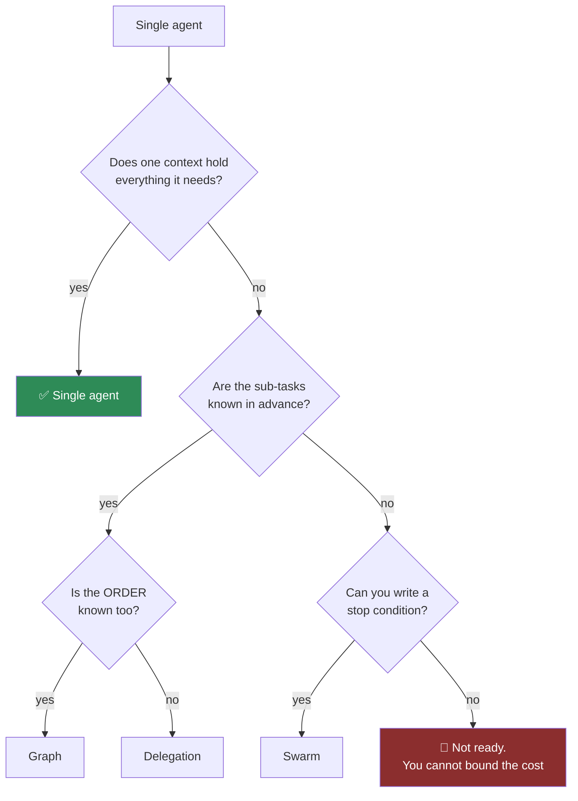
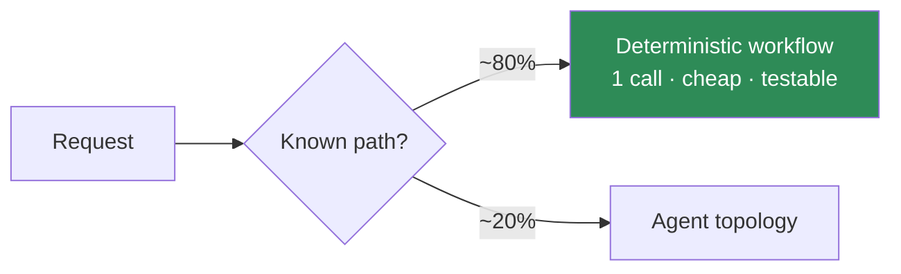

# How to · Choose a multi-agent topology (and justify it)

**Time:** 1 hour. **Output:** a topology, its H× multiplier, and what you rejected.

---

## 1. Start from one agent and force yourself upward

The default is a single agent. Every step up needs a reason you can state.

**The stop-condition question is a gate, not a preference.** A swarm you cannot bound is an unbounded
budget with a diagram.

## 2. Price it before you commit

| Topology | H× | Buys you | Costs you |
| --- | --- | --- | --- |
| Single | 1.0× | — | — |
| Delegation ×2 | 1.8–2.6× | Focused context | Context re-sent per handoff |
| Delegation ×4 | 3.0–4.5× | Sharper specialisation | Orchestrator reasons 4× |
| Critique, 1 round | 2.1–2.8× | Quality on ambiguous output | Double generation |
| Critique, until-converged | 3–8×, unbounded | Higher ceiling | **Cap it** |
| Graph, fixed | 1.2–2.0× | Determinism, testability | Rigidity |
| Swarm ×3 | 4–12×, unbounded | Parallel exploration | **Stop rule required** |

Measure your own — see [Handoff Multiplier](../../frameworks/handoff-multiplier.md).

## 3. Apply the three tests before adding any agent

1. **What does this agent know or do that the existing one cannot?**
   "It focuses better" is a prompt problem. Splitting multiplies it.
2. **What is the measured H× delta?** Not estimated.
3. **What is the stop condition?**

## 4. The move that beats all of them

Before choosing a topology, check whether most traffic needs one at all:

Routing the known majority away from the agent typically cuts cost 40–70%. It is almost always available
and almost never done first.

## 5. Record the decision

| Field | |
| --- | --- |
| Chosen topology | |
| H×, measured | |
| Rejected, and why | |
| Stop condition | |
| Merge-call cost | *(the most expensive call — carries all results)* |
| What would make us collapse it back | |

The last row prevents topologies from becoming permanent by default.

**Related:** [Handoff Multiplier](../../frameworks/handoff-multiplier.md) ·
[Autonomy Ladder](../../frameworks/autonomy-ladder.md) ·
[Module 07](../../../modules/07-strands-multi-agent-patterns/)
