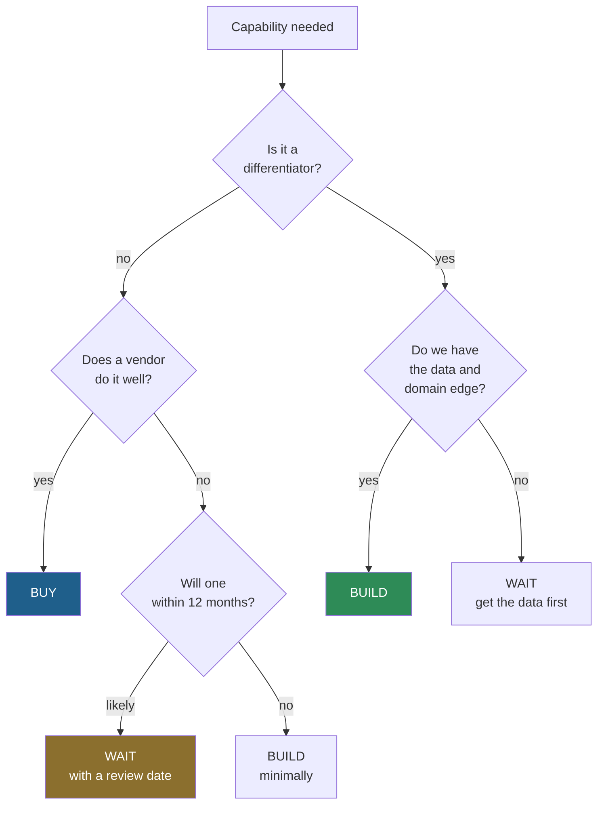

# Playbook · Build, buy, or wait

Three options, and "wait" is a real one that almost never gets a fair hearing.

---

## The decision



## The differentiator test

> If a competitor had exactly this capability tomorrow, would we lose anything?

**No** → it is infrastructure. Buy it, or wait for it to commoditise.
**Yes** → what is the moat? Almost always the **data** and the **domain rules**, not the agent code.

Most organisations build agents around undifferentiated workflows and buy the parts where their domain
knowledge would actually have been an advantage. Check which way round yours is.

## What "build" actually costs

The build estimate is the small half.

| Cost | Often forgotten |
| --- | --- |
| Initial build | — |
| Evaluation harness and golden set | **Usually omitted entirely** |
| Ongoing evaluation and sampling | Recurring, forever |
| Prompt and corpus maintenance | Recurring — the corpus is a product now |
| Model migration | Every model generation |
| On-call and incident response | New rota, or new load on an existing one |
| The organisational change to route work to it | The [②→③ link](../frameworks/value-trace.md) |

The last row kills more projects than any technical factor. A working agent nobody routes work to produces
zero value at full cost.

## When "wait" is right

Waiting is a decision, not indecision — **if** it has a review date and a trigger.

| Wait when | Because |
| --- | --- |
| The capability is commoditising quickly | Your build will be obsolete before it pays back |
| You do not have the data yet | Get the data. That work is never wasted |
| The process is about to change | Automating a process you are redesigning is waste |
| Nobody owns the outcome | Without an owner, nothing ships regardless |

```
Decision: wait
Review on: —
Triggers an earlier review: [vendor announces X] | [our volume exceeds Y]
Owner: —
```

A "wait" with no review date is a "no" that nobody had to defend.

## When "buy" goes wrong

| Risk | Ask before signing |
| --- | --- |
| Your data leaves your boundary | Where is it processed and retained? |
| You cannot evaluate it | Can we run **our** golden set against it? |
| Their abstention behaviour is not yours | What does it do when it doesn't know? |
| Lock-in at the data layer | Can we export embeddings, corpus and history? |
| Their model changes underneath you | Are model versions pinnable? |

> **The one question that separates good vendors from good demos:** *"Can we run our own golden set against
> it, and see the per-case results?"* A vendor who cannot let you do this is asking you to buy at
> [E2](../frameworks/evidence-ladder.md).

## The hybrid that usually wins

Buy the platform, build the domain layer:

| Buy | Build |
| --- | --- |
| Model hosting, runtime, memory, gateway | Tool implementations against your systems |
| Retrieval infrastructure | Chunking and evaluation for **your** corpus |
| Observability plumbing | Golden set and gate thresholds |
| Guardrail enforcement | Guardrail **policy** |

This is what [this curriculum](../../modules/) teaches, and it is not a coincidence — it is where the
economics land for most organisations.

## Presenting the decision

| Field | |
| --- | --- |
| Capability | |
| Differentiator? | Yes / No, with the test result |
| Recommendation | Build / Buy / Wait |
| If build: total cost including the seven rows above | |
| If buy: the golden-set answer | |
| If wait: review date and triggers | |
| What would change this decision | |

The last row is what makes it a decision rather than a position.

**Related:** [Value Trace](../frameworks/value-trace.md) · [Scope Fence](../frameworks/scope-fence.md)
