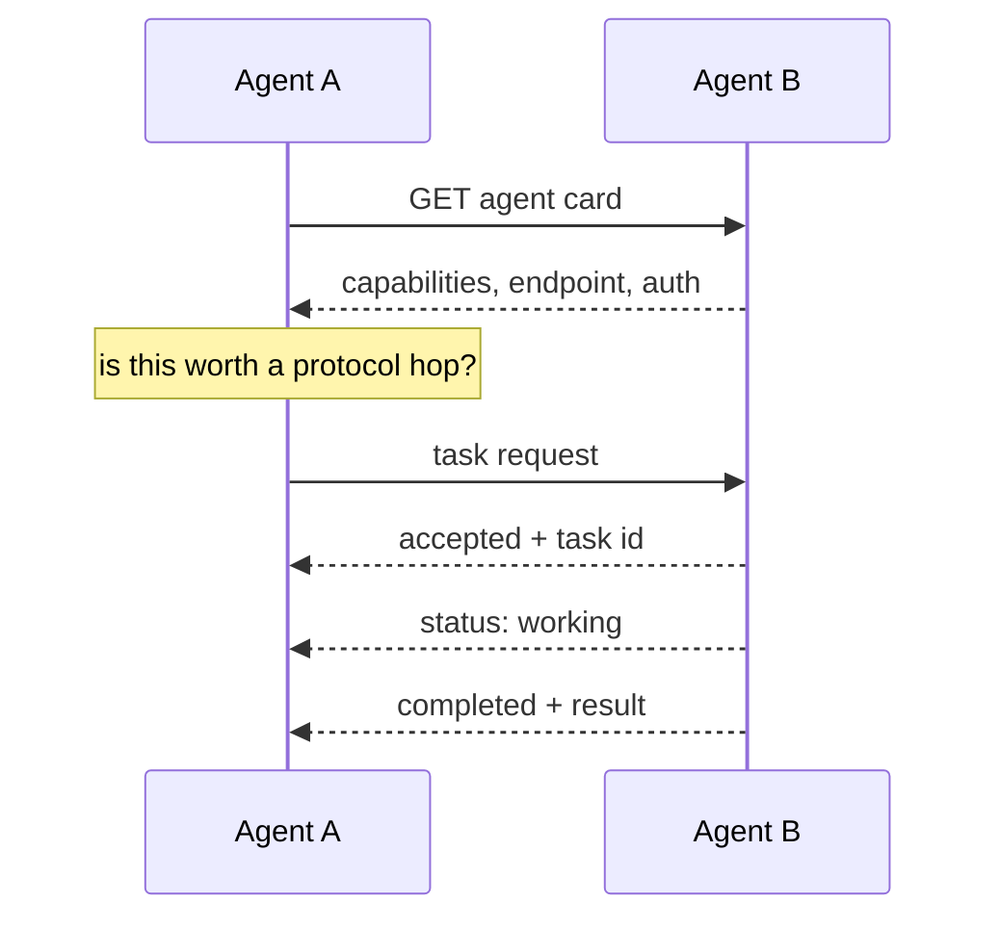

# MCP and A2A — Cheat Sheet

Two protocols, two different problems. Knowing which one you need saves a lot of accidental architecture.

---

## The distinction

| | **MCP** — Model Context Protocol | **A2A** — Agent-to-Agent |
| --- | --- | --- |
| Connects | An agent → **tools and data** | An agent → **another agent** |
| Other side is | A capability server | An autonomous agent with its own judgement |
| You get back | A tool result | A task result, possibly after several turns |
| Analogy | A library | A colleague |
| Use when | You want capabilities without bespoke integration | Another team's agent already does the job |

> Simplest rule: **MCP for hands, A2A for colleagues.**

## MCP

An MCP server exposes tools; any compliant client can consume them. That is the whole value: write the
integration once, use it from any agent framework.

```python
from mcp import stdio_client, StdioServerParameters
from strands.tools.mcp import MCPClient

mcp = MCPClient(lambda: stdio_client(
    StdioServerParameters(command="python", args=["unit_server.py"])))

with mcp:
    agent = Agent(tools=mcp.list_tools_sync())
    agent("Convert 180 minutes to hours.")
```

**The two operations that matter:** `tools/list` (discover) and `tools/call` (invoke).

### MCP cautions

| Risk | Guard |
| --- | --- |
| Server latency becomes your latency | Timeouts on every call |
| Server failure becomes your failure | Explicit error path; do not let it bubble as a hang |
| Server tools are outside your review | Audit them like your own — [Tool Surface Audit](../frameworks/tool-surface-audit.md) |
| Tool descriptions you did not write | Read them as the model receives them |
| **Prompt injection via tool results** | Treat all tool output as data, never as instructions |

That last one is the important one. An MCP server you do not control can return text designed to steer
your agent. Tool results are untrusted input.

## A2A

A2A lets independently built agents discover and delegate to each other.

**The agent card** — the published capability document:

```json
{ "name": "refund-desk",
  "description": "Assesses refund eligibility against published fare rules.",
  "capabilities": ["refund.assess", "refund.explain"],
  "endpoint": "https://…/a2a",
  "authentication": { "schemes": ["bearer"] } }
}
```

**Task lifecycle:** `submitted → working → input-required → completed | failed`



### The question to ask before reaching for A2A

> Would a function call do?

If both agents live in your process, A2A adds latency, an auth surface and a new class of failure for
nothing. A2A earns its cost when the other agent is **owned by someone else**, **deployed separately**, or
**evolving independently**.

### A2A cautions

| Risk | Guard |
| --- | --- |
| Card overstates capability | Verify against your own test cases before trusting it |
| Remote agent hangs | Timeout; treat `working` past a bound as failure |
| Chained abstention loss | If B abstains, A must not paper over it |
| Cost multiplies invisibly | Each hop is a full agent run — [Handoff Multiplier](../frameworks/handoff-multiplier.md) |

## Decision table

| Situation | Use |
| --- | --- |
| Need a calculator, a search, a database read | MCP |
| Need a capability another team already built as an agent | A2A |
| Need it in-process, same team, same repo | Neither — a function |
| Need to expose your agent to other teams | A2A server + card |
| Need to expose your tools to other agents | MCP server |

## Learn it properly

[Module 06](../../modules/06-strands-foundations/) (MCP) ·
[Module 12](../../modules/12-a2a-and-a2ui-interop/) (A2A and A2UI) ·
[Module 12 LLD](../../docs/architecture/lld/12-a2a-and-a2ui-interop.md)
