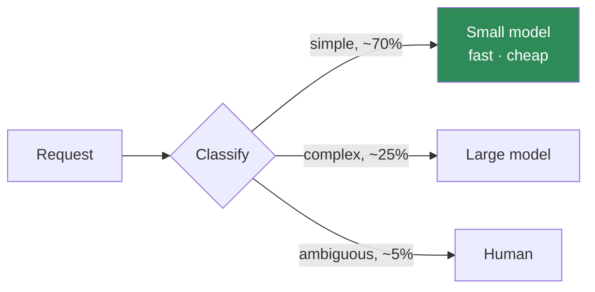

# Model Selection — Cheat Sheet

Choose on four dimensions, write down what you rejected, and re-decide when something changes.

---

## The four dimensions

Score your workload 1–5 on each **before** looking at any model.

| Dimension | Ask | High score means |
| --- | --- | --- |
| **Capability** | How hard is the reasoning? Multi-step? Ambiguous? | Frontier model |
| **Latency** | Is a human waiting? What is the p95 budget? | Smaller/faster model |
| **Context** | How much must be in the window at once? | Large-context model |
| **Cost ceiling** | What is the cost per task you can defend? | Cheaper model, or routing |

Most workloads are **not** 5-5-5-5. If yours scores 5 everywhere, you have not decomposed it enough.

## The routing move

The highest-value model decision is usually not *which* model — it is *how many*.



A cheap classifier plus a small model on the common path typically cuts cost 40–70% with no measurable
quality loss on that path. Prove it on your golden set, per route.

## The decision record

Do not skip this. It is what makes the choice defensible six months later.

| Field | Yours |
| --- | --- |
| Workload | |
| Capability / Latency / Context / Cost | _ / _ / _ / _ |
| Chosen model + inference profile ID | |
| Rejected, and why | |
| Fallback model | |
| Cost per task, measured | |
| Re-decide when | new model generation · cost > X · p95 > Y |

The "rejected, and why" row is what stops the same debate recurring every quarter.

## Practical rules

1. **Bigger context is not free.** You pay for what you put in it, and attention dilutes across long
   contexts. See [Context Budget Ledger](../frameworks/context-budget-ledger.md).
2. **Test the fallback deliberately.** Failover is only useful if you know what it does to quality — run
   your golden set against the fallback and record the delta.
3. **Pin the model in the manifest.** An unpinned model changes behaviour with no code change, and you
   will not be able to correlate the regression.
4. **Re-run the golden set on every model change.** A model change invalidates every claim above E1 on the
   [Evidence Ladder](../frameworks/evidence-ladder.md).
5. **Measure, do not infer.** Benchmarks measure the benchmark's distribution, not yours.

## Checking what is actually available

```bash
# models you can use in this region
aws bedrock list-foundation-models --region us-east-1 \
  --query 'modelSummaries[].modelId' --output table

# inference profile IDs — use these as modelId
aws bedrock list-inference-profiles --region us-east-1 \
  --query 'inferenceProfileSummaries[].[inferenceProfileId,status]' --output table
```

An empty list is a permissions state (model access not requested), not an outage.

## The cost comparison that matters

Compare **cost per resolved task**, not cost per 1,000 tokens. A cheaper model that needs two extra turns
to get to the same answer is not cheaper.

```
cost_per_resolved_task = cost_per_task ÷ autonomous_resolution_rate
```

A model that costs 30% more but resolves 20% more cases autonomously is usually the better buy. Run the
arithmetic before the debate.

## Learn it properly

[Module 01](../../modules/01-llm-and-aws-bridge/) · [Pick-the-model exercise](../../modules/01-llm-and-aws-bridge/exercises/Day1.5_Ad-Hoc_Exercise_PickTheModel.pdf) ·
[LLM Intuition Bank](../../modules/01-llm-and-aws-bridge/exercises/LLM_Intuition_Bank.md)
