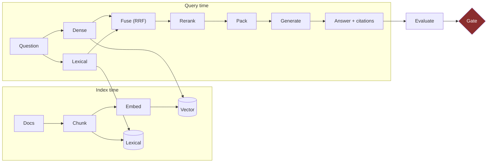

# RAG Pipeline — Cheat Sheet

Every stage, what decides it, and the failure it causes when you get it wrong.

---

## The pipeline



## Stage by stage

| Stage | Decided by | Get it wrong and |
| --- | --- | --- |
| **Chunking** | Document *structure*, not a character count | The answer straddles a boundary — no retriever can win |
| **Embedding** | Domain + language + cost | Semantically close ≠ relevant for your domain |
| **Lexical index** | Exact terms matter (codes, clause numbers, SKUs) | Embeddings blur exactly the terms users search for |
| **Fusion** | Reciprocal rank fusion — no score tuning needed | Score-scale mismatch makes one arm dominate |
| **Reranking** | Measured recall gain vs added latency | Latency and cost for nothing |
| **Packing** | A **token budget**, not top-k | Dilution, or silent truncation |
| **Generation** | Prompt requiring citation, permitting abstention | Confident-wrong |
| **Evaluation** | A golden set frozen before tuning | You measure your own reflection |

## Chunking — the highest-leverage decision

| Strategy | Use when | Watch for |
| --- | --- | --- |
| Fixed size + overlap | Homogeneous prose | Boundaries mid-argument |
| Structural (heading/section) | Policy, docs, contracts | Wildly uneven sizes |
| Semantic | Mixed, unstructured | Cost; unpredictable sizes |
| Parent-child | Precise retrieval, broad context | Two stores to keep in sync |

> **Test:** take 10 real questions. For each, find the passage that answers it. Does it sit inside **one**
> chunk? If not, chunking is your bug, and no amount of reranking will fix it.

## Hybrid + RRF

```python
def rrf(rankings, k=60):
    scores = {}
    for ranking in rankings:                 # one list per retriever
        for rank, doc_id in enumerate(ranking, start=1):
            scores[doc_id] = scores.get(doc_id, 0) + 1.0 / (k + rank)
    return sorted(scores, key=scores.get, reverse=True)
```

RRF merges by **rank**, not score, so you never tune score scales. `k=60` is the conventional default.

Implementation: [`ragkit/fusion.py`](../../modules/10-rag-opensearch-litellm/labs/rag-labs/ragkit/fusion.py).

## Reranking — earn it or drop it

Reranking costs a model call and real latency. Prove it:

| | recall@5 | p95 latency | Cost/query |
| --- | --- | --- | --- |
| Hybrid only | | | |
| Hybrid + rerank | | | |
| **Delta** | | | |

If the recall delta is under ~5 points, drop it. Most teams keep it because it *sounds* right.

## Packing to a budget

`top_k=5` is not a budget — five long passages can be four times five short ones.

```python
def pack(passages, budget_tokens):
    out, used = [], 0
    for p in passages:                       # already ranked
        t = count_tokens(p.text)
        if used + t > budget_tokens: break
        out.append(p); used += t
    return out
```

See [Context Budget Ledger](../frameworks/context-budget-ledger.md).

## Find your k

Run the golden set at k = 3, 5, 10, 20 and plot accuracy. **The curve peaks and then falls** — more context
dilutes attention. Most teams never look and sit past the peak, paying more for worse answers.

## Evaluation

| Metric | Question |
| --- | --- |
| Recall@k | Was the answering passage retrieved at all? |
| Precision@k | How much of what we retrieved was useful? |
| Faithfulness | Is the answer supported by the retrieved text? |
| Citation accuracy | Does the cited passage support the claim? |
| Abstention recall | Did it decline when it should have? |

**Recall@k is the ceiling.** If the passage was not retrieved, no prompt can recover it. Debug retrieval
before generation, always.

## Failure decoder

| Symptom | Cause | Fix |
| --- | --- | --- |
| Nothing relevant retrieved | Chunk boundary, or lexical terms lost | Restructure chunks; add lexical arm |
| Relevant retrieved, answer ignores it | Dilution, or bad rank position | Cut k; rerank; check position |
| Answer with no citation | Parametric memory | Contract test; require abstention on empty retrieval |
| Citation does not support the claim | Citation theatre | Entailment check — [Grounding Triangle](../frameworks/grounding-triangle.md) |
| Quality decayed as corpus grew | Recall decayed at fixed k | Re-measure; improve ranking, do not just raise k |

## Learn it properly

[Module 10](../../modules/10-rag-opensearch-litellm/) ·
[`rag_by_hand.py`](../../modules/10-rag-opensearch-litellm/src/rag_by_hand.py) (no library) ·
[`ragkit`](../../modules/10-rag-opensearch-litellm/labs/rag-labs/ragkit/) (reusable) ·
[Module 10 LLD](../../docs/architecture/lld/10-rag-opensearch-litellm.md)
