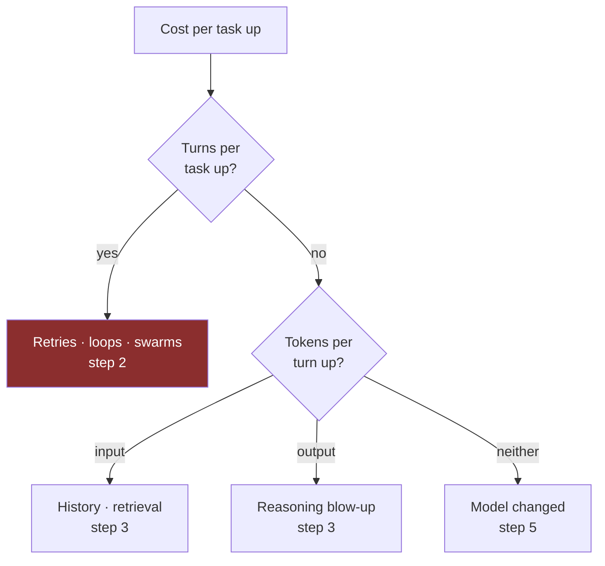

# Runbook · Cost has spiked

**Severity:** medium-high — it compounds daily and is usually invisible until billing.
**First action:** find out whether it is traffic or a cliff. Those are entirely different problems.

---

## 0. Traffic or cliff? (2 minutes)

```
cost_per_task = total_cost ÷ tasks_completed
```

| Result | Meaning |
| --- | --- |
| Cost up, **cost per task flat** | Traffic growth. Not an incident — a capacity conversation |
| Cost up, **cost per task up** | A [cost cliff](../frameworks/cost-cliff-map.md). Continue |
| Cost up, **task count flat or zero** | Idle infrastructure. Jump to step 4 |

## 1. Narrow it with three metrics



```
fields task_id, turn, tokens_in, tokens_out
| stats max(turn) as turns, sum(tokens_in) as tin, sum(tokens_out) as tout by task_id
| stats avg(turns), avg(tin), avg(tout) by bin(1d)
```

## 2. Turns per task rose

The expensive case — turns multiply four of the [six taxes](../frameworks/token-tax-ledger.md).

| Cause | Check | Fix |
| --- | --- | --- |
| Retry storm | Error rate on a downstream tool | Retry cap, backoff, circuit breaker |
| Loop non-convergence | Tasks hitting max iterations | Hard cap + escalation; check the tool actually answers |
| Swarm unbounded | Any swarm without a stop rule | Add one. Today |
| Topology changed | Recent architecture change | Measure H× — [Handoff Multiplier](../frameworks/handoff-multiplier.md) |

## 3. Tokens per turn rose

**Input tokens up:**

| Cause | Fix |
| --- | --- |
| History buffer unbounded | Cap; summarise at a threshold |
| Retrieval top-k raised | Re-measure — the accuracy curve usually peaks below where people set k |
| Tool schemas grew | Prune per route |
| System prompt grew | Check the diff; instruction tax is paid every turn |

**Output tokens up:** a prompt change made the model deliberate more. Bisect the prompt diff. Cap
`maxTokens`.

## 4. Idle infrastructure

The most common cause, and the least interesting. These bill for **existing**:

```
□ OpenSearch Serverless collections      □ AgentCore runtimes
□ AgentCore gateways                      □ AgentCore memory stores
□ Knowledge bases + vector stores         □ Orphaned CDK stacks
```

```bash
aws opensearchserverless list-collections
aws bedrock-agent list-knowledge-bases
```

Full checklist: [cost controls](../../docs/setup/cost-controls.md#teardown-checklist).

## 5. Model changed under you

```
fields model_id | stats count() as calls by model_id | sort calls desc
```

Fallback to a larger model is [cliff 7](../frameworks/cost-cliff-map.md). If fallback share > 5%, find out
why the primary is throttling.

## 6. Prevent the recurrence

- [ ] Budget alarm at 50/80/100% — [set one](../../docs/setup/cost-controls.md)
- [ ] Cost per task as a daily metric with an owner
- [ ] Hard iteration cap in code, not in the prompt
- [ ] Stop rule on every swarm and critique loop
- [ ] Teardown checklist run at every phase end
- [ ] Cost threshold in the [quality gate](../../modules/13-agentic-qa-and-evaluation/src/quality_gate.py)

## The post-mortem question

> **Which of the eight cliffs was it, and why was there no guard?**

Every cliff on the [map](../frameworks/cost-cliff-map.md) has a known guard. If one fired, the guard was
missing or unowned — that is the finding.
