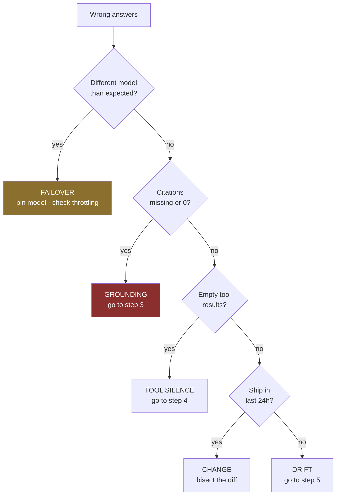

# Runbook · The agent is giving wrong answers

**Severity:** high — customers or staff are acting on bad output.
**First action:** decide whether to keep serving. Everything else is diagnosis.

---

## 0. Stop the bleeding (first 5 minutes)

| Question | If yes |
| --- | --- |
| Are wrong answers reaching customers? | Switch to human handoff for the affected route now |
| Is it one route or all routes? | Disable the affected route only |
| Did something ship in the last 24h? | Roll back first, diagnose after — see [rollback](rollback.md) |

> Rolling back before diagnosing is correct. A hypothesis is not worth an hour of bad answers.

## 1. Establish the shape (next 10 minutes)

Pull five facts. Each is one log query — see [observability](../quick-reference/observability.md).

| Fact | Query | Rules out |
| --- | --- | --- |
| Which model answered? | `stats count() by model_id` | Silent failover |
| Turns per task changed? | `stats max(turn) by task_id` | Loop / retry change |
| Citations present? | `filter decision="answer" and citations=0` | Grounding failure |
| Empty tool results? | `filter tool_result_empty=1` | Tool returning defaults |
| Abstention rate moved? | `stats sum(decision="abstain")*100/count() by bin(1d)` | Prompt or retrieval drift |

## 2. Branch on what you found

## 3. Grounding failure

The agent is answering from parametric memory rather than your corpus.

1. Take three wrong answers. For each, run the retrieval step alone. **Was the answering passage
   retrieved at all?**
   - **No** → retrieval problem. Check index freshness, then chunking. Recall is the ceiling; no prompt
     fixes a passage that was never retrieved.
   - **Yes** → generation problem. The passage was there and was ignored. Check rank position and context
     dilution — see [Context Budget Ledger](../frameworks/context-budget-ledger.md).
2. Check ingestion freshness: is the newest indexed document older than your sync interval × 2?
3. Verify the contract test asserting citations is actually running. If it is not, that is your root cause.

## 4. Tool silence

A tool returned `{}`, `[]` or `null` and the model narrated around the gap.

1. Which tool, and how often? `stats count() by tool | filter tool_result_empty=1`
2. Is the downstream system healthy?
3. **Fix the contract, not the prompt:** return `{"status":"no_matches","searched":"..."}` instead of a
   bare empty result. An empty list reads as "nothing applies", which is the opposite of "I could not
   check".

## 5. Drift, with no change on your side

| Check | Action |
| --- | --- |
| Corpus grew since last evaluation | Re-measure recall@k on the golden set |
| Input distribution shifted | Sample 50 recent inputs — do they resemble the golden set? |
| Provider-side model update | Pin the model version; re-run the golden set |
| Guardrail rules changed | Check intervention rate for a step change |

## 6. Before you close it

- [ ] Add the failing cases to the [golden set](../../modules/13-agentic-qa-and-evaluation/src/golden_set.jsonl)
- [ ] Confirm the gate would now catch this — if not, the gate is the real defect
- [ ] Record the signature in the [Failure Signature Catalog](../frameworks/failure-signature-catalog.md)
- [ ] If detection took over an hour, add the missing signal to
      [the watchlist](../frameworks/silent-degradation-watchlist.md)

## The post-mortem question

> **How long was this happening before we noticed?**

If the answer is more than a day, the incident is a monitoring failure, not a model failure. Fix that first.
