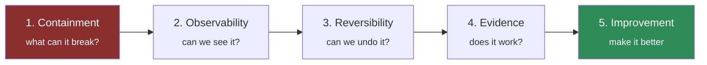

# Runbook · You have inherited someone else's agent

Nobody documented it. The person who built it has left. It is in production. Here is the order to find
things out — designed so that each step is useful even if you stop there.

---

## Hour 1 — what is it allowed to do?

Start with blast radius, not with the code. This is the only step that is genuinely urgent.

- [ ] List every tool the agent can call
- [ ] For each, answer: **does it write anything?**
- [ ] For each write: is it reversible, and how wide is its reach?
- [ ] Read the IAM role. What can it actually touch, regardless of the prompt?

Score them on the [Blast Radius Grid](../frameworks/blast-radius-grid.md). Any red tool without a human
commit step is your first work item, before you understand anything else about the system.

> The prompt may say "never do X". Only the IAM policy determines whether it *can*.

## Hour 2 — what does it claim, and what proves it?

- [ ] Is there a golden set? When was a case last added?
- [ ] Is there a gate? Does it **fail the build**, or only warn?
- [ ] What is the last recorded evaluation run?
- [ ] What claim is being made about this system, and on what
      [evidence rung](../frameworks/evidence-ladder.md)?

If there is no golden set, you have an E1/E2 system that people believe is E4. That gap is the most
important thing you now know.

## Hour 3 — can you see it working?

Check the [three vital signs](../quick-reference/observability.md):

- [ ] Is the answering model logged per response?
- [ ] Is abstention rate measurable?
- [ ] Is cost per task measurable?

If none exist, add them before changing anything else. You cannot safely modify a system you cannot observe.

## Hour 4 — can you undo a deploy?

- [ ] Is there a version manifest?
- [ ] Does it cover code, **prompt**, model and config?
- [ ] Has rollback ever been performed?
- [ ] Try it in a non-production environment. Time it.

See [rollback](rollback.md). If prompts are not versioned, that is your second work item.

## Day 2 — what shape is it?

Now read the code.

| Question | Where to look | Tells you |
| --- | --- | --- |
| What [rung](../frameworks/autonomy-ladder.md) is it on? | The loop | Whether it is over-built |
| What topology? | Agent composition | Its [H× cost](../frameworks/handoff-multiplier.md) |
| Where do prompts live? | Files or embedded? | Whether they are governable |
| Is there an iteration cap? | The loop | Whether a runaway is possible |
| Is retrieval evaluated? | Any recall measurement? | Whether grounding is real |

## Day 3 — score it honestly

Fill in the [Agent Readiness Scorecard](../frameworks/agent-readiness-scorecard.md). Do not soften it — the
score is a description of what you inherited, not a judgement of you.

Then write one page:

> **What we have:** [scorecard total, dimension by dimension]
> **The three things that could hurt us:** [ranked]
> **What I propose to do first:** [usually: containment, then observability, then evidence]

## The order that works

**Resist starting at 5.** The instinct on inheriting a system is to improve it. Containment, observability
and reversibility are what let you improve it safely — and they are usually what is missing.

## The question to ask the team

> "What does it do when it does not know the answer?"

The answer tells you almost everything about how carefully the system was built. If nobody knows, you have
found your third work item.
