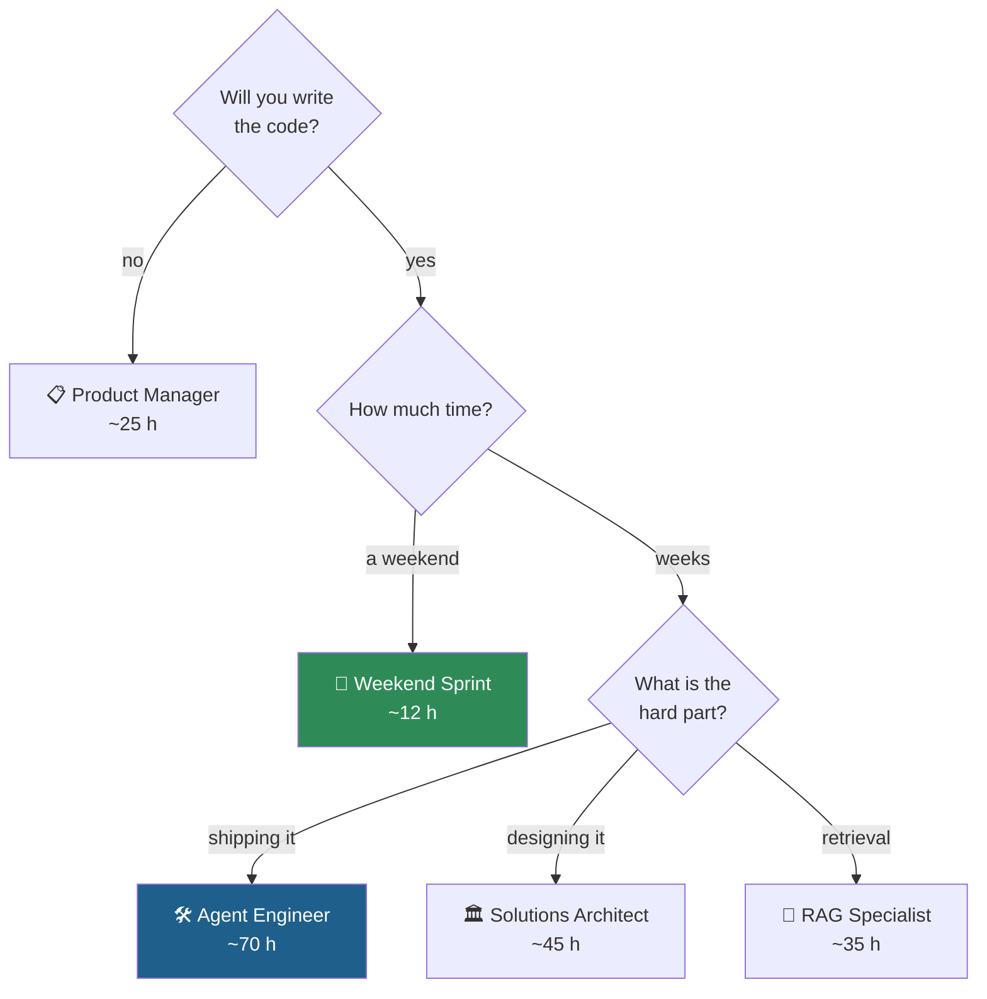

# Start Here

You have landed in a 16-module curriculum with about 500 files. This page gets you to the right place in
under two minutes.

## 1. Pick your path



→ **[All five paths, in detail](learning-paths/)**

## 2. Set up AWS before you need it

Model access approval is not always instant.
**[Do the AWS setup now](setup/aws-account-setup.md)**, then
[set a budget alarm](setup/cost-controls.md).

Modules 00, 01 and 15 need no AWS account at all — start there while access is pending.

## 3. Know how a module works

Every module has the same shape:

```
README.md      ← the order to do things in. Always start here.
slides/        ← decks and reading material
notebooks/     ← runnable code
exercises/     ← practice. Attempt closed-book.
solutions/     ← worked answers. Read after you have a wrong answer.
activities/    ← workbooks where a decision gets written down and costed
src/           ← supporting source
labs/          ← extended hands-on (Module 10)
guides/        ← runbooks and reference
```

## 4. Understand the shape of the whole thing

- **[Architecture HLD](architecture/)** — how the modules compose, and the TravelMind reference application
- **[LLD per module](architecture/lld/)** — zoom into any module's mechanism
- **[Portable GenAI concepts](concepts/genai-core-concepts.md)** — what transfers anywhere
- **[Where AWS comes in](concepts/aws-service-map.md)** — the service map
- **[Portability matrix](concepts/portability-matrix.md)** — an honest answer on lock-in

## 5. When you get stuck

1. [Troubleshooting](setup/troubleshooting.md) — the errors this curriculum actually produces
2. [Glossary](concepts/glossary.md) — terms as used here
3. [Discussions](https://github.com/akash-coded/aws-bedrock-agentcore-strands/discussions) — ask, with the
   module and the exact error

## The four rules

1. **Attempt exercises closed-book.** Solutions read *after* a wrong answer teach; read before, they do not.
2. **Fill in the workbooks.** That is where a decision becomes defensible.
3. **Do not skip [Module 05](../modules/05-agent-loop-no-framework-to-strands/).** Writing the agent loop
   by hand is what stops every later framework from being magic.
4. **Tear down what you create.** [Cost controls](setup/cost-controls.md) has the checklist.
