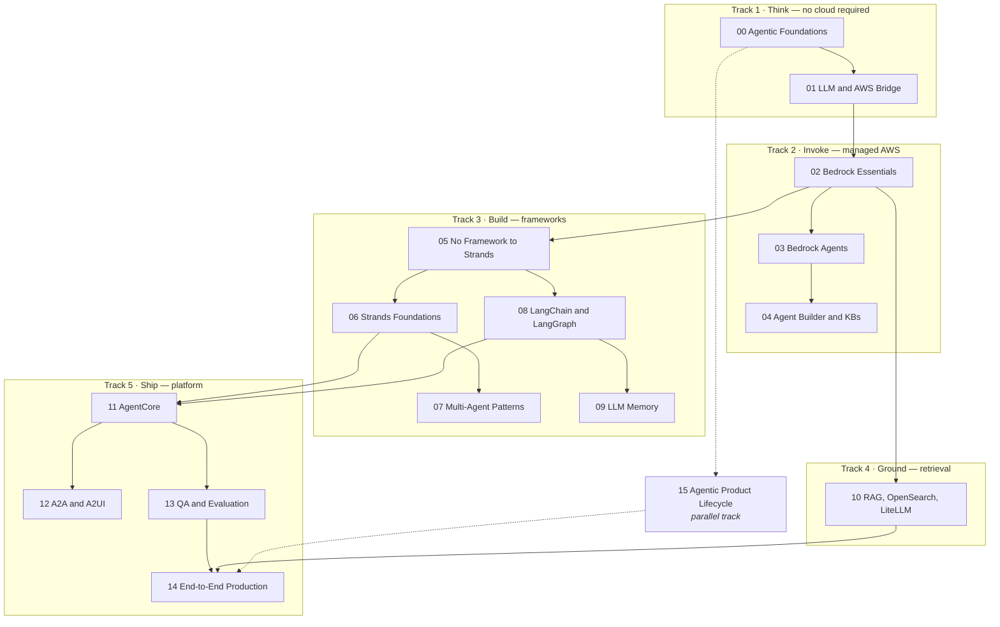
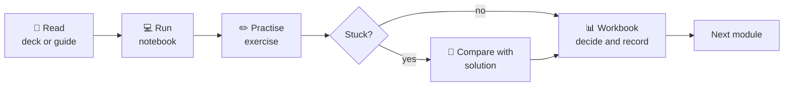
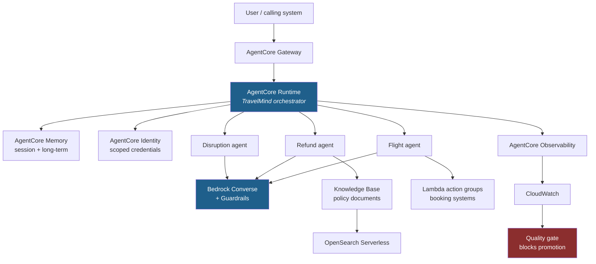
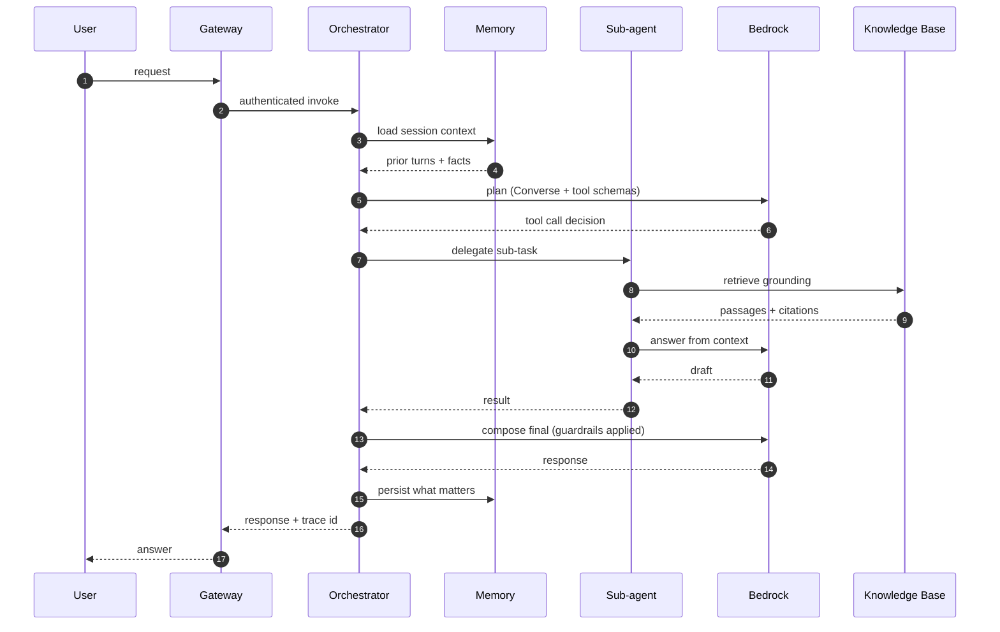

# Architecture: High-Level Design

Two systems are described here. The first is **the curriculum itself** — how 16 modules compose into a
capability. The second is **TravelMind**, the reference application you build across them.

Zoom into any module's internals via the [LLD index](lld/).

---

## 1. The curriculum as a system

**Design rule behind the ordering:** every abstraction is preceded by the thing it abstracts. You write the
agent loop before meeting Strands (05 → 06). You build RAG by hand before touching a managed knowledge base
(10). You test before you deploy (13 → 14). Nothing is magic because you built the previous layer.

## 2. Learning-flow model

Every module follows this shape. The workbook step matters: it is where a design decision gets written
down and costed, which is what makes it defensible later.

## 3. TravelMind — the reference application

TravelMind is a travel-operations agent. It appears first in Module 02 as a single Bedrock call and is
still there in Module 14 as a gated, deployed, multi-agent service. Same domain, growing architecture.

### Where each module contributes

| Layer | Built in | Notebook to read first |
| --- | --- | --- |
| Model invocation, guardrails | [02](../../modules/02-bedrock-essentials/) | `converse_api_masterclass.ipynb` |
| Managed agent + action groups | [03](../../modules/03-bedrock-agents/) | `03_action_groups.ipynb` |
| Knowledge base grounding | [04](../../modules/04-agent-builder-and-knowledge-bases/) | `kb_guardrails_travelmind_notebook.ipynb` |
| Orchestrator and sub-agents | [06](../../modules/06-strands-foundations/), [07](../../modules/07-strands-multi-agent-patterns/) | `03_strands_multiagent_capstone.ipynb` |
| Retrieval quality | [10](../../modules/10-rag-opensearch-litellm/) | `labs/rag-labs/04_retrieval_reranking.ipynb` |
| Runtime, memory, identity, gateway | [11](../../modules/11-bedrock-agentcore/) | `02_agentcore_runtime.ipynb` |
| Evaluation and the gate | [13](../../modules/13-agentic-qa-and-evaluation/) | `src/quality_gate.py` |
| Release, failover, rollback | [14](../../modules/14-end-to-end-production/) | `deploy_e2e.ipynb` |

A rendered reference architecture image also ships with Module 14:
[`reference_architecture.png`](../../modules/14-end-to-end-production/assets/reference_architecture.png).

## 4. Request lifecycle

Note steps 4 and 12: memory is a read *and* a write decision, and both cost money. Note step 13: the trace
id is what makes [Module 13](../../modules/13-agentic-qa-and-evaluation/) possible at all.

## 5. Cost model

Cost lands in four places. Each has a module that teaches you to control it:

| Driver | Controlled by | Where |
| --- | --- | --- |
| Tokens per turn | Prompt and verbosity discipline | [00](../../modules/00-agentic-foundations/), [03](../../modules/03-bedrock-agents/) |
| Turns per task | Topology choice — every handoff re-sends context | [07](../../modules/07-strands-multi-agent-patterns/) |
| Retrieval volume | Chunk size, top-k, reranking depth | [10](../../modules/10-rag-opensearch-litellm/) |
| Runtime and storage | Retention policy, capacity planning | [11](../../modules/11-bedrock-agentcore/) |

Workbooks: [Token cost calculator](../../modules/00-agentic-foundations/activities/H2-03_Token-Cost_Calculator.xlsx) ·
[Bedrock cost estimator](../../modules/06-strands-foundations/activities/Bedrock_Cost_Estimator.xlsx) ·
[AgentCore cost and capacity](../../modules/11-bedrock-agentcore/activities/AgentCore_Cost_and_Capacity_Workbench.xlsx)

---

**Zoom in:** [Low-level design per module](lld/) &nbsp;·&nbsp;
**Zoom out:** [Learning paths](../learning-paths/) &nbsp;·&nbsp; [Concepts](../concepts/)
