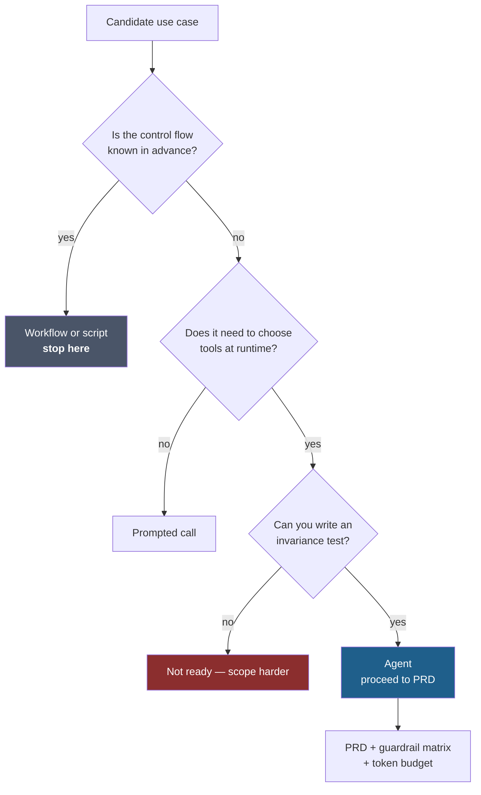

# LLD · Module 00 — Agentic Foundations

> The decision procedure that runs *before* any code: is this an agent, and what would make it good?

**Module:** [`modules/00-agentic-foundations/`](../../../modules/00-agentic-foundations/) &nbsp;·&nbsp; **HLD:** [architecture overview](../README.md)

---

## Mechanism

## Components

| Component | Responsibility | Implemented in |
| --- | --- | --- |
| Four-quadrant classifier | Places a use case on autonomy × determinism | `activities/H1-01_Four-Quadrant_Classifier.xlsx` |
| Failure-pattern diagnostic | Six recurring agentic failure modes, scored | `activities/H1-04_Six-Failure-Pattern_Diagnostic.xlsx` |
| Invariance-test builder | Turns a vague behaviour into a testable claim | `activities/H1-03_Invariance-Test_Builder.xlsx` |
| PRD builder | One-page agent spec a reviewer can attack | `activities/H2-01_PRD-Builder.xlsx` |
| Token-cost calculator | Cost per interaction before building | `activities/H2-03_Token-Cost_Calculator.xlsx` |
| Guardrail-coverage matrix | Which risks are covered, by what | `activities/H2-04_Guardrail-Coverage_Matrix.xlsx` |

## Interfaces and contracts

- **Agent PRD** — Goal, non-goals, tools, guardrails, success metric, token budget
- **Invariance claim** — `for all paraphrases P of input I, output satisfies predicate Q`

## Failure modes

| Failure | Consequence | How you detect it |
| --- | --- | --- |
| Agent chosen for a deterministic task | Cost and latency with no benefit | Classifier lands in the deterministic quadrant |
| Untestable outcome | Cannot evaluate later | Invariance builder produces no predicate |
| Unbudgeted design | Cost discovered after architecture is fixed | Calculator left empty |

## Done when

You can hand the PRD to someone who was not in the room and they can argue with it on specifics.

---

[⬅️ All LLDs](./) &nbsp;·&nbsp; [🏛️ HLD](../README.md) &nbsp;·&nbsp; [📦 Module 00](../../../modules/00-agentic-foundations/)
