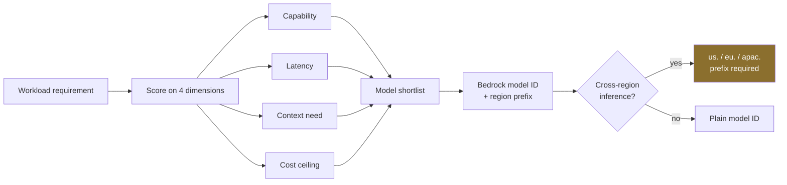

# LLD · Module 01 — LLM Intuition and the AWS Bridge

> The mapping from model behaviour to Bedrock configuration choices.

**Module:** [`modules/01-llm-and-aws-bridge/`](../../../modules/01-llm-and-aws-bridge/) &nbsp;·&nbsp; **HLD:** [architecture overview](../README.md)

---

## Mechanism

## Components

| Component | Responsibility | Implemented in |
| --- | --- | --- |
| Intuition bank | MCQs, diagrams and error-fixing that build the mental model | `exercises/LLM_Intuition_Bank.md` |
| Model picker | Requirement-to-model decision exercise | `exercises/Day1.5_Ad-Hoc_Exercise_PickTheModel.pdf` |
| Companion workbook | Records the choice and its justification | `activities/Day15_Companion_Workbook.xlsx` |

## Interfaces and contracts

- **Model selection record** — Requirement → dimension scores → chosen model ID → rejected alternatives and why

## Failure modes

| Failure | Consequence | How you detect it |
| --- | --- | --- |
| Missing regional prefix | `ValidationException` on invoke | Model ID lacks `us.`/`eu.`/`apac.` |
| Context window over-provisioned | Paying for tokens you dilute | Measured prompt size far below window |

## Done when

You can justify your model choice on four dimensions and name what you would switch to under a cost cut.

---

[⬅️ All LLDs](./) &nbsp;·&nbsp; [🏛️ HLD](../README.md) &nbsp;·&nbsp; [📦 Module 01](../../../modules/01-llm-and-aws-bridge/)
