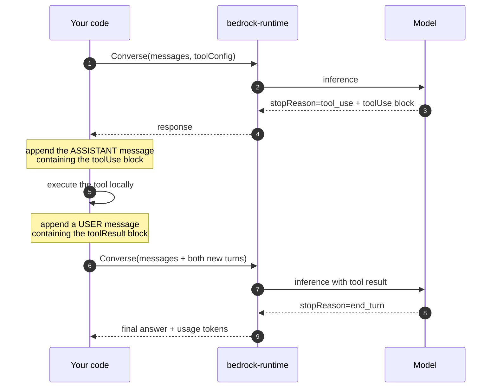

# LLD · Module 02 — Amazon Bedrock Essentials

> The Converse API request/response cycle, including the tool-use round trip that most people get wrong.

**Module:** [`modules/02-bedrock-essentials/`](../../../modules/02-bedrock-essentials/) &nbsp;·&nbsp; **HLD:** [architecture overview](../README.md)

---

## Mechanism

## Components

| Component | Responsibility | Implemented in |
| --- | --- | --- |
| Converse client | `boto3.client('bedrock-runtime')` — invocation only | `notebooks/converse_api_masterclass.ipynb` |
| Tool config | Name, description and JSON schema per tool | `notebooks/travelmind_refund_agent.ipynb` |
| Knowledge base query | Retrieve and ground | `src/knowledge_base_query.py` |
| Guardrail | Policy applied at inference | `exercises/Exercise_4_Guardrails_Strands_and_End-to-End_Agent_Design.pdf` |

## Interfaces and contracts

- **Tool schema** — `{name, description, inputSchema:{json:{type, properties, required}}}`
- **Usage accounting** — `response['usage'] = {inputTokens, outputTokens, totalTokens}`

## Failure modes

| Failure | Consequence | How you detect it |
| --- | --- | --- |
| Assistant tool-use turn dropped from history | Model loses the thread; repeats or hallucinates the call | Second Converse call sends only the tool result |
| `bedrock` client used for invocation | `AttributeError` / operation not found | Client is `bedrock`, not `bedrock-runtime` |
| Vague tool description | Model calls the wrong tool or fills arguments badly | Tool called with plausible-but-wrong arguments |

## Done when

A two-tool agent completes a multi-step request and your token accounting matches the response usage block.

---

[⬅️ All LLDs](./) &nbsp;·&nbsp; [🏛️ HLD](../README.md) &nbsp;·&nbsp; [📦 Module 02](../../../modules/02-bedrock-essentials/)
