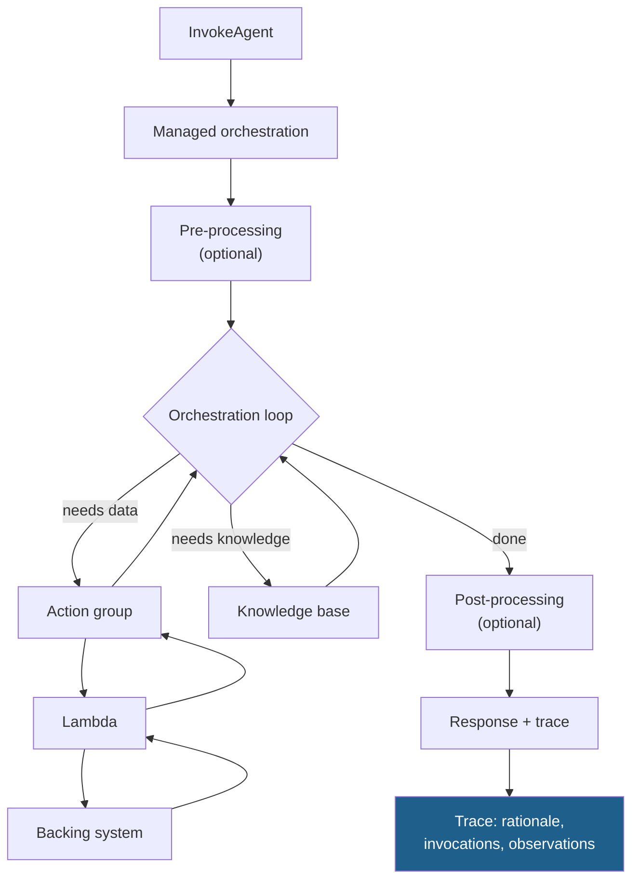

# LLD · Module 03 — Amazon Bedrock Agents

> What the managed agent loop does on your behalf, and how to see inside it.

**Module:** [`modules/03-bedrock-agents/`](../../../modules/03-bedrock-agents/) &nbsp;·&nbsp; **HLD:** [architecture overview](../README.md)

---

## Mechanism

## Components

| Component | Responsibility | Implemented in |
| --- | --- | --- |
| Agent definition | Instructions, model, idle-session TTL | console or `00_connect_to_agent.ipynb` |
| Action group | OpenAPI schema + Lambda executor | `notebooks/03_action_groups.ipynb` |
| Trace | Per-step rationale and invocation record | `notebooks/01_setup_invoke_trace.ipynb` |
| Hand-built loop | The same behaviour, written out in full | `notebooks/02_handbuilt_loop.ipynb` |

## Interfaces and contracts

- **Action group schema** — OpenAPI 3.0 — operationId, description, parameters, responses
- **Lambda event** — `{actionGroup, apiPath, httpMethod, parameters, sessionAttributes}`
- **Lambda response** — `{response:{actionGroup, apiPath, httpMethod, httpStatusCode, responseBody}}`

## Failure modes

| Failure | Consequence | How you detect it |
| --- | --- | --- |
| Lambda missing resource policy | Agent cannot invoke; opaque failure | `AccessDeniedException` in the trace |
| Response shape wrong | Agent cannot parse the observation | Trace shows the observation as an error string |
| Instructions too long | Every turn pays for them | Input tokens high on a trivial request |

## Done when

You can point at a trace and explain every step, then reproduce the same behaviour with the hand-built loop.

---

[⬅️ All LLDs](./) &nbsp;·&nbsp; [🏛️ HLD](../README.md) &nbsp;·&nbsp; [📦 Module 03](../../../modules/03-bedrock-agents/)
