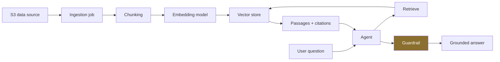

# LLD · Module 04 — Agent Builder, Knowledge Bases and Guardrails

> How a knowledge base is wired to an agent, and where grounding actually happens.

**Module:** [`modules/04-agent-builder-and-knowledge-bases/`](../../../modules/04-agent-builder-and-knowledge-bases/) &nbsp;·&nbsp; **HLD:** [architecture overview](../README.md)

---

## Mechanism

## Components

| Component | Responsibility | Implemented in |
| --- | --- | --- |
| Data source | S3 prefix, sync schedule | `notebooks/kb_guardrails_agentbuilder_notebook.ipynb` |
| Chunking strategy | Fixed, hierarchical or semantic | same notebook |
| Guardrail policy | Denied topics, content filters, PII handling | `slides/kb_guardrails_deck.md` |
| Action group runbook | Lambda wiring, end to end | `guides/TravelMind_ActionGroups_Lambda_RoC_Runbook.md` |

## Interfaces and contracts

- **Retrieval result** — `{content, location, score}` — citations are the proof of grounding
- **Guardrail outcome** — `GUARDRAIL_INTERVENED` with the triggering policy named

## Failure modes

| Failure | Consequence | How you detect it |
| --- | --- | --- |
| Ingestion not re-run after source change | Stale answers, confidently delivered | Sync timestamp older than the document |
| Answer without citations | Grounding did not happen; the model answered from parametric memory | Empty citation array |
| Guardrail never adversarially tested | False confidence | No red-team cases in the test set |

## Done when

Ask a question whose answer exists only in your corpus and confirm the citation points at the right document.

---

[⬅️ All LLDs](./) &nbsp;·&nbsp; [🏛️ HLD](../README.md) &nbsp;·&nbsp; [📦 Module 04](../../../modules/04-agent-builder-and-knowledge-bases/)
