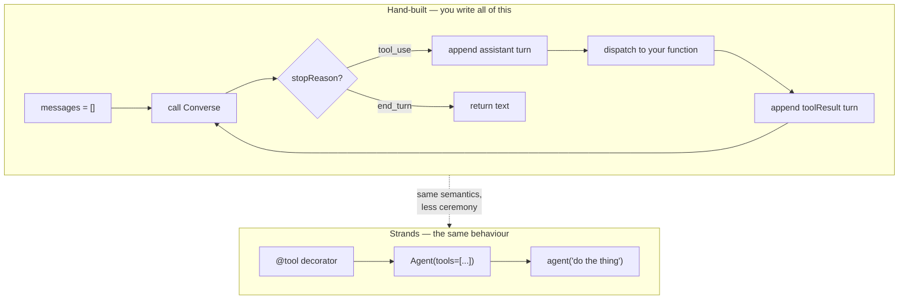

# LLD · Module 05 — The Agent Loop: No Framework to Strands

> The loop itself — first written out, then replaced by a framework, with the difference made explicit.

**Module:** [`modules/05-agent-loop-no-framework-to-strands/`](../../../modules/05-agent-loop-no-framework-to-strands/) &nbsp;·&nbsp; **HLD:** [architecture overview](../README.md)

---

## Mechanism

## Components

| Component | Responsibility | Implemented in |
| --- | --- | --- |
| Hand-built loop | Every step explicit, no library | `notebooks/Day6_Demo_1_NoStrands.ipynb` |
| Strands equivalent | Same agent, framework-managed | `notebooks/Day6_Demo_2_Strands.ipynb` |
| Live AWS runbook | Running against real Bedrock | `guides/Day6_LiveAWS_Runbook.md` |

## Interfaces and contracts

- **Tool function** — Python callable + schema derived from signature and docstring
- **Loop termination** — Explicit max-iterations plus a stop condition — never unbounded

## Failure modes

| Failure | Consequence | How you detect it |
| --- | --- | --- |
| No iteration cap | Runaway loop burns budget | Turn count climbs without converging |
| Tool exception unhandled | Loop dies mid-task | Traceback instead of an observation the model can react to |
| Framework adopted before the loop is understood | Cannot debug it | You cannot say what Strands is doing on your behalf |

## Done when

You can delete the framework, rebuild the agent by hand, and get the same behaviour.

---

[⬅️ All LLDs](./) &nbsp;·&nbsp; [🏛️ HLD](../README.md) &nbsp;·&nbsp; [📦 Module 05](../../../modules/05-agent-loop-no-framework-to-strands/)
