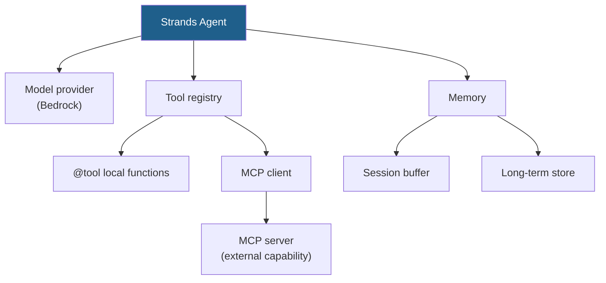

# LLD · Module 06 — Strands Foundations: Tools, Memory and MCP

> Tools, memory and MCP as three separable concerns inside a Strands agent.

**Module:** [`modules/06-strands-foundations/`](../../../modules/06-strands-foundations/) &nbsp;·&nbsp; **HLD:** [architecture overview](../README.md)

---

## Mechanism

## Components

| Component | Responsibility | Implemented in |
| --- | --- | --- |
| Agent | Model + tools + memory composition | `notebooks/01_strands_foundations.ipynb` |
| Tool registry | Local `@tool` functions and MCP-provided tools | `notebooks/02_strands_tools_memory_mcp.ipynb` |
| MCP client | Consumes any compliant server | same notebook |
| Tool catalogue | The design artefact behind the registry | `activities/Tool_Catalog.xlsx` |
| Unit server | A minimal MCP server to test against | `src/unit_server.py` |

## Interfaces and contracts

- **`@tool`** — Docstring becomes the model-facing description; type hints become the schema
- **MCP** — `tools/list` and `tools/call` over the protocol transport

## Failure modes

| Failure | Consequence | How you detect it |
| --- | --- | --- |
| Docstring written for humans | Model mis-calls the tool | Wrong tool chosen for a clear request |
| Unbounded session buffer | Context overflow mid-conversation | Input tokens grow every turn |
| MCP server trusted implicitly | Agent inherits its failure modes and its latency | No timeout or error path around MCP calls |

## Done when

Swap a local tool for the same capability via MCP and the agent behaves identically.

---

[⬅️ All LLDs](./) &nbsp;·&nbsp; [🏛️ HLD](../README.md) &nbsp;·&nbsp; [📦 Module 06](../../../modules/06-strands-foundations/)
