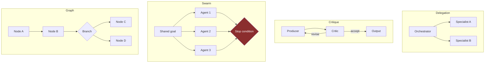

# LLD · Module 07 — Multi-Agent Patterns with Strands

> Four topologies, their cost profile, and the selection rule between them.

**Module:** [`modules/07-strands-multi-agent-patterns/`](../../../modules/07-strands-multi-agent-patterns/) &nbsp;·&nbsp; **HLD:** [architecture overview](../README.md)

---

## Mechanism

## Components

| Component | Responsibility | Implemented in |
| --- | --- | --- |
| Workflow patterns | Deterministic composition | `notebooks/NB1_Foundations_Workflow_Patterns.ipynb` |
| Agentic patterns | Delegation and critique | `notebooks/NB2_Agentic_Patterns.ipynb` |
| Autonomous vs deterministic | When to hand over control | `notebooks/NB3_Autonomous_Deterministic_Orchestration.ipynb` |
| Graph vs swarm, head to head | Same task, both topologies, measured | `notebooks/PierPoint_Release_Desk_Graph_vs_Swarm.ipynb` |
| Pattern selector | The decision workbook | `../06-strands-foundations/activities/MultiAgent_Pattern_Selector.xlsx` |

## Interfaces and contracts

- **Handoff** — Each handoff re-sends context — the cost multiplier is the topology
- **Termination** — Swarms require an explicit stop rule; graphs terminate structurally

## Failure modes

| Failure | Consequence | How you detect it |
| --- | --- | --- |
| Swarm without a stop rule | Unbounded spend | Run does not converge |
| Agents added to fix prompt quality | The problem is now N times larger | Same error appears in every agent's output |
| Handoff loses context | Downstream agent solves the wrong problem | Correct sub-answers, wrong overall answer |

## Done when

For your task you can state which pattern you chose, its token multiplier, and what you rejected.

---

[⬅️ All LLDs](./) &nbsp;·&nbsp; [🏛️ HLD](../README.md) &nbsp;·&nbsp; [📦 Module 07](../../../modules/07-strands-multi-agent-patterns/)
