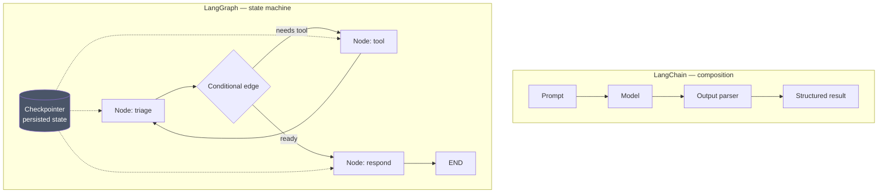

# LLD · Module 08 — LangChain and LangGraph

> Composition in LangChain, state in LangGraph, and an evidence-based comparison with Strands.

**Module:** [`modules/08-langchain-and-langgraph/`](../../../modules/08-langchain-and-langgraph/) &nbsp;·&nbsp; **HLD:** [architecture overview](../README.md)

---

## Mechanism

## Components

| Component | Responsibility | Implemented in |
| --- | --- | --- |
| Runnable chain | `prompt | model | parser` composition | `notebooks/03_basic_langchain.ipynb` |
| Tools and middleware | Agent hands and interception | `notebooks/05_advanced_langchain.ipynb` |
| LangGraph state machine | Nodes, edges, checkpointing | `notebooks/PierPoint_LangGraph_Chains_to_Swarms.ipynb` |
| Side-by-side | Same task in both frameworks | `notebooks/06_langchain_vs_strands_side_by_side.ipynb` |

## Interfaces and contracts

- **Runnable** — Anything implementing `invoke` / `stream` / `batch` composes with `|`
- **Graph state** — A typed dict merged by reducers across nodes
- **Checkpointer** — Persists state per thread id — required for resumable runs

## Failure modes

| Failure | Consequence | How you detect it |
| --- | --- | --- |
| Chain used where a function would do | Indirection with no benefit | The chain has one step |
| Unbounded graph state | Memory and cost grow per turn | Checkpoint size climbing |
| Framework chosen by allegiance | Wrong tool for the constraint | No written comparison exists |

## Done when

You implemented the same task twice and can state the trade-off in one sentence each way.

---

[⬅️ All LLDs](./) &nbsp;·&nbsp; [🏛️ HLD](../README.md) &nbsp;·&nbsp; [📦 Module 08](../../../modules/08-langchain-and-langgraph/)
