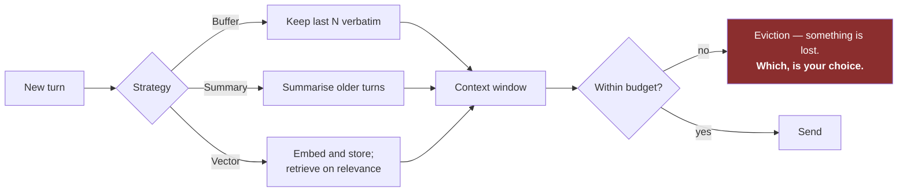

# LLD · Module 09 — LLM Memory Mechanics

> Three memory strategies, what each drops, and the cost of each.

**Module:** [`modules/09-llm-memory/`](../../../modules/09-llm-memory/) &nbsp;·&nbsp; **HLD:** [architecture overview](../README.md)

---

## Mechanism

## Components

| Component | Responsibility | Implemented in |
| --- | --- | --- |
| Memory demonstration | All three strategies, side by side | `notebooks/01_demonstration_llm_memory.ipynb` |
| Activities | Implement and compare | `exercises/02_activities_llm_memory.ipynb` |

## Interfaces and contracts

- **Memory interface** — `load(session) -> context` and `save(session, turn)` — both cost money
- **Retention policy** — An explicit statement of what is kept, for how long, and why

## Failure modes

| Failure | Consequence | How you detect it |
| --- | --- | --- |
| Summary drops the decisive fact | Confident wrong answer later | User restates something already told |
| Vector memory returns stale context | Contradicts the recent turn | Retrieved fragment older than a correction |

## Done when

You can state what your agent forgets, deliberately, and show the turn where it happens.

---

[⬅️ All LLDs](./) &nbsp;·&nbsp; [🏛️ HLD](../README.md) &nbsp;·&nbsp; [📦 Module 09](../../../modules/09-llm-memory/)
