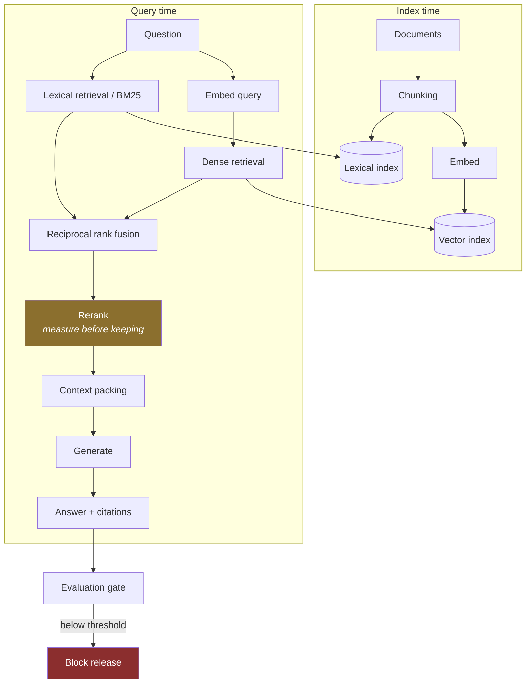

# LLD · Module 10 — RAG, OpenSearch and LiteLLM

> The full retrieval pipeline, stage by stage, with a measurable gate at the end.

**Module:** [`modules/10-rag-opensearch-litellm/`](../../../modules/10-rag-opensearch-litellm/) &nbsp;·&nbsp; **HLD:** [architecture overview](../README.md)

---

## Mechanism

## Components

| Component | Responsibility | Implemented in |
| --- | --- | --- |
| `ragkit.chunking` | Chunk strategies | `labs/rag-labs/ragkit/chunking.py` |
| `ragkit.dense` / `ragkit.lexical` | The two retrieval arms | `labs/rag-labs/ragkit/` |
| `ragkit.fusion` | Reciprocal rank fusion | `labs/rag-labs/ragkit/fusion.py` |
| `ragkit.rerank` | Second-stage reordering | `labs/rag-labs/ragkit/rerank.py` |
| `ragkit.context` | Context packing under a token budget | `labs/rag-labs/ragkit/context.py` |
| `ragkit.evals` | Metrics and the gate | `labs/rag-labs/ragkit/evals.py` |
| `ragkit.cost` | Token and money accounting | `labs/rag-labs/ragkit/cost.py` |
| RAG by hand | No library — the reference implementation | `src/rag_by_hand.py` |

## Interfaces and contracts

- **Chunk** — `{id, text, source, offset}` — offset is what makes a citation checkable
- **Retrieval result** — `{chunk, score, retriever}` — keep the retriever so fusion is auditable
- **Gate** — Metrics compared to agreed thresholds; non-zero exit on failure

## Failure modes

| Failure | Consequence | How you detect it |
| --- | --- | --- |
| Chunk boundary splits the answer | Retrieval cannot win, no matter the model | Answer spans two chunks, neither sufficient |
| Reranking assumed to help | Latency and cost for nothing | No before/after measurement exists |
| Evaluation on the same set you tuned on | Overfit; production regresses | Golden set built after tuning |

## Done when

Your gate fails on a deliberately degraded index, and passes on the good one.

---

[⬅️ All LLDs](./) &nbsp;·&nbsp; [🏛️ HLD](../README.md) &nbsp;·&nbsp; [📦 Module 10](../../../modules/10-rag-opensearch-litellm/)
