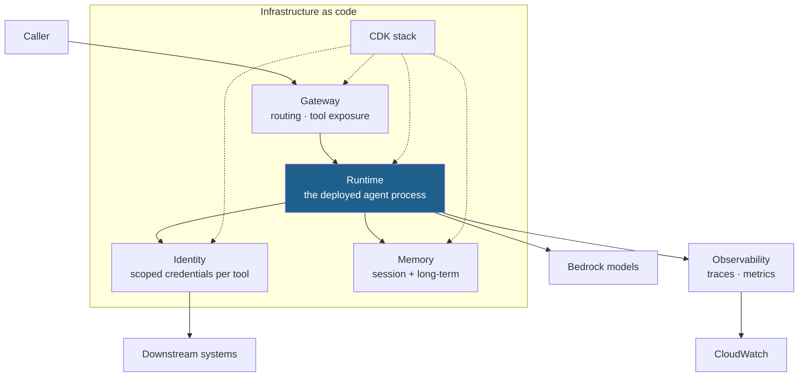

# LLD · Module 11 — Amazon Bedrock AgentCore

> The five AgentCore primitives and how a deployed agent uses each.

**Module:** [`modules/11-bedrock-agentcore/`](../../../modules/11-bedrock-agentcore/) &nbsp;·&nbsp; **HLD:** [architecture overview](../README.md)

---

## Mechanism

## Components

| Component | Responsibility | Implemented in |
| --- | --- | --- |
| Runtime | Agent as an invocable service | `notebooks/02_agentcore_runtime.ipynb` |
| Memory | Managed session and long-term store | `notebooks/03_memory.ipynb` |
| Identity | Per-tool scoped credentials | `notebooks/04_tools_and_identity.ipynb` |
| Gateway | Front door and tool surface | `../14-end-to-end-production/notebooks/gateway_routing.ipynb` |
| Reference project | Complete CDK-managed deployment | `src/MyFirstRuntimeAgent/` |
| Three-way deploy | Strands, LangGraph and no framework | `walkthroughs/AgentCore_01_Strands_Minimum_Deploy.ipynb` |

## Interfaces and contracts

- **Runtime entrypoint** — A handler receiving the invocation payload and returning the response
- **Memory retention** — Explicit TTL and scope — the thing that controls the storage bill
- **Identity scope** — Least privilege per tool, not per agent

## Failure modes

| Failure | Consequence | How you detect it |
| --- | --- | --- |
| Over-broad runtime role | Blast radius far larger than the task | One role granting every downstream action |
| No retention policy | Storage and cost grow without bound | Memory size climbing across sessions |
| Observability added after an incident | No trace of the failure you need to explain | No trace id in the response |

## Done when

You deploy the same agent three ways and the runtime does not care which framework produced it.

---

[⬅️ All LLDs](./) &nbsp;·&nbsp; [🏛️ HLD](../README.md) &nbsp;·&nbsp; [📦 Module 11](../../../modules/11-bedrock-agentcore/)
