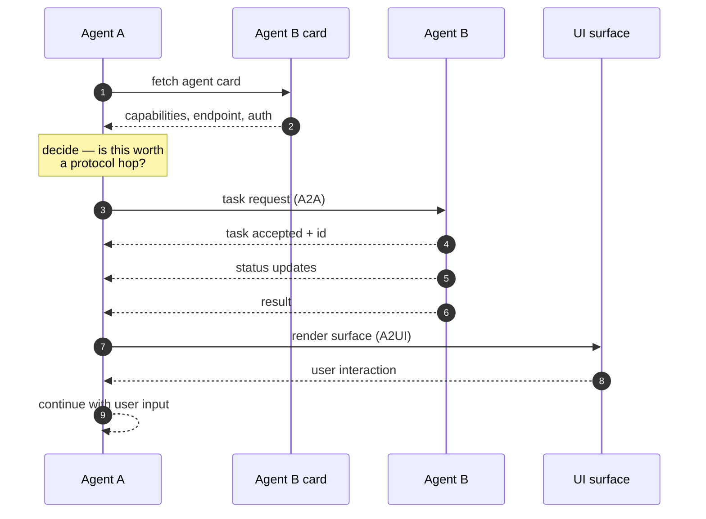

# LLD · Module 12 — A2A and A2UI: Agent Interoperability

> Capability discovery between agents, and agent-driven interface.

**Module:** [`modules/12-a2a-and-a2ui-interop/`](../../../modules/12-a2a-and-a2ui-interop/) &nbsp;·&nbsp; **HLD:** [architecture overview](../README.md)

---

## Mechanism

## Components

| Component | Responsibility | Implemented in |
| --- | --- | --- |
| Agent card | Published capability document | `exercises/exercise_1_read_the_card.md` |
| A2A server | Exposing an agent over the protocol | `src/my_a2a_server.py`, `src/refund_server.py` |
| A2A on AgentCore | Protocol against the managed runtime | `notebooks/02_A2A_on_AgentCore.ipynb` |
| A2UI surfaces | Agent-driven interface | `notebooks/Notebook_1_A2UI_through_Strands.ipynb` |

## Interfaces and contracts

- **Agent card** — Name, description, capabilities, endpoint, auth scheme
- **Task lifecycle** — `submitted → working → input-required → completed | failed`

## Failure modes

| Failure | Consequence | How you detect it |
| --- | --- | --- |
| Card overstates capability | Caller trusts it and fails downstream | Task fails after acceptance |
| Protocol used where a function call would do | Latency and failure surface for nothing | Both agents in the same process |
| No timeout on remote agent | Caller hangs | Task stuck in `working` |

## Done when

Two agents you built separately complete a task together, and you can justify why it needed A2A.

---

[⬅️ All LLDs](./) &nbsp;·&nbsp; [🏛️ HLD](../README.md) &nbsp;·&nbsp; [📦 Module 12](../../../modules/12-a2a-and-a2ui-interop/)
