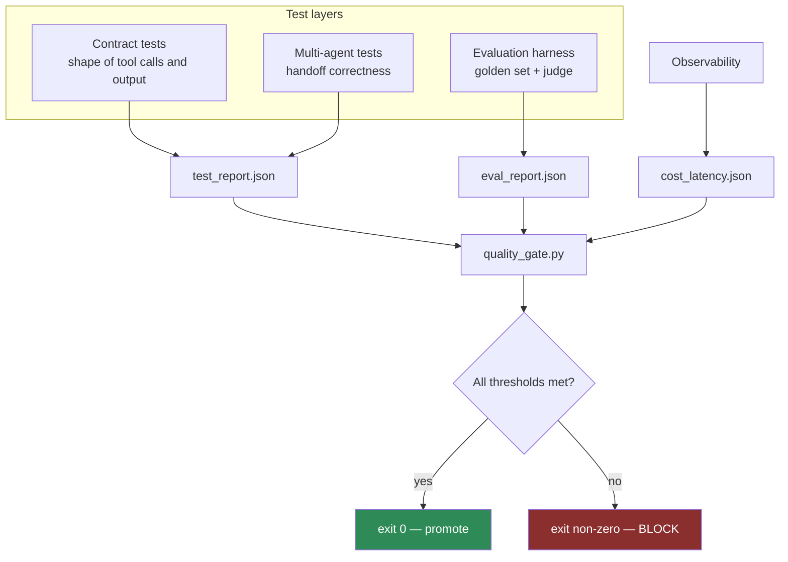

# LLD · Module 13 — Agentic QA and Evaluation

> The test pyramid for non-deterministic systems, ending in a gate that blocks a deploy.

**Module:** [`modules/13-agentic-qa-and-evaluation/`](../../../modules/13-agentic-qa-and-evaluation/) &nbsp;·&nbsp; **HLD:** [architecture overview](../README.md)

---

## Mechanism

## Components

| Component | Responsibility | Implemented in |
| --- | --- | --- |
| Golden set | Curated inputs with agreed outputs | `src/golden_set.jsonl` |
| Contract tests | Output and tool-call shape | `src/test_contracts.py` |
| Multi-agent tests | Handoff correctness | `src/test_multiagent.py` |
| Evaluation harness | Runs the golden set and scores it | `notebooks/eval_harness.ipynb` |
| Quality gate | Reads three reports, decides, exits | `src/quality_gate.py` |
| CloudWatch filters | Finding the failing run | `src/cloudwatch_filters.md` |

## Interfaces and contracts

- **`test_report.json`** — `{failed: int}`
- **`eval_report.json`** — `{pass_rate: float, safety_pass_rate: float}`
- **`cost_latency.json`** — `{cost_usd: float, p95_ms: int}`
- **Thresholds** — Live in `config.THRESHOLDS` — changing a bar is a reviewed commit

## Failure modes

| Failure | Consequence | How you detect it |
| --- | --- | --- |
| Gate warns instead of failing | Ignored within a week | Exit code always 0 |
| Golden set of happy paths | Passes everything, catches nothing | No known-failure cases present |
| Thresholds edited to make a build pass | The gate now measures nothing | Threshold change in the same commit as the fix |

## Done when

Deliberately regress the agent and watch the gate block the promotion.

---

[⬅️ All LLDs](./) &nbsp;·&nbsp; [🏛️ HLD](../README.md) &nbsp;·&nbsp; [📦 Module 13](../../../modules/13-agentic-qa-and-evaluation/)
