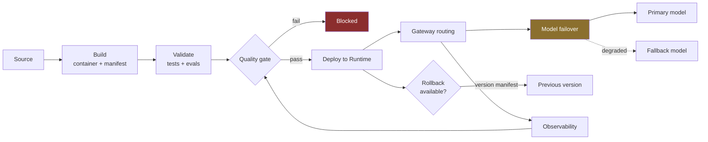

# LLD · Module 14 — End-to-End Production Pipeline

> Build, validate, deploy, route, fail over, gate — the whole release path.

**Module:** [`modules/14-end-to-end-production/`](../../../modules/14-end-to-end-production/) &nbsp;·&nbsp; **HLD:** [architecture overview](../README.md)

---

## Mechanism

## Components

| Component | Responsibility | Implemented in |
| --- | --- | --- |
| Agent source | The deployable agent | `src/travelmind_agent.py` |
| Runtime wrapper | Entrypoint for AgentCore | `src/travelmind_runtime.py` |
| Model failover | Primary/fallback routing | `src/model_failover.py` |
| Release script | Versioning and promotion | `src/release.py` |
| Version manifest | What is deployed, and what to roll back to | `src/version_manifest.json` |
| Readiness checklist | The pre-flight | `src/readiness_checklist.md` |
| IAM policy | Least-privilege invoke | `src/iam_invoke_policy.json` |

## Interfaces and contracts

- **Version manifest** — `{version, model, prompt_version, image_digest, evaluated_at}`
- **Failover** — Log which model actually answered — silent degradation is worse than failure
- **Rollback** — Previous manifest is deployable without a rebuild

## Failure modes

| Failure | Consequence | How you detect it |
| --- | --- | --- |
| No rollback path | Incident becomes an outage | Manifest has no previous entry |
| Silent failover | Quality drops with no signal | Response does not record the answering model |
| Prompt changed without version bump | Cannot correlate a regression to a change | Manifest prompt version unchanged across a behaviour change |

## Done when

You can roll back to the previous version from the manifest alone, without rebuilding.

---

[⬅️ All LLDs](./) &nbsp;·&nbsp; [🏛️ HLD](../README.md) &nbsp;·&nbsp; [📦 Module 14](../../../modules/14-end-to-end-production/)
