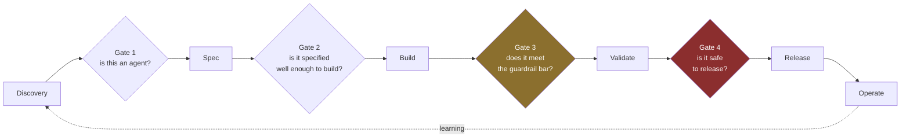

# LLD · Module 15 — Agentic Product Lifecycle

> The artefact set owed at each gate, and the decisions each gate forces.

**Module:** [`modules/15-agentic-product-lifecycle/`](../../../modules/15-agentic-product-lifecycle/) &nbsp;·&nbsp; **HLD:** [architecture overview](../README.md)

---

## Mechanism

## Components

| Component | Responsibility | Implemented in |
| --- | --- | --- |
| Artefact set | What is owed, when | `slides/The_Agentic_Artefact_Set.pptx` |
| Decision tool | Which artefacts this build actually needs | `activities/WB1_Artefact_Decision_Tool.xlsx` |
| Backlog planner | Sequencing artefacts against delivery | `activities/WB2_Backlog_Artefact_Planner.xlsx` |
| Gate review | Running the review itself | `exercises/Exercise_A_The_Gate_Review.md` |
| Cost-cut scenario | Responding with options, not capitulation | `exercises/Exercise_B_The_Cost_Cut_Ultimatum.md` |

## Interfaces and contracts

- **Gate decision** — Go / no-go / conditional, with the condition written down and owned
- **Guardrail bar** — A threshold engineering has confirmed is achievable at a stated cost

## Failure modes

| Failure | Consequence | How you detect it |
| --- | --- | --- |
| Gate approved on demo quality | Production differs; demos are chosen | No adversarial cases in the review |
| Guardrail bar set unilaterally | Unmeetable, so quietly ignored | Engineering was not consulted on cost |
| Artefacts produced for compliance, not decisions | Cost with no benefit | Nobody reads them after the gate |

## Done when

Someone outside the team can read your artefact set and reconstruct why each decision was made.

---

[⬅️ All LLDs](./) &nbsp;·&nbsp; [🏛️ HLD](../README.md) &nbsp;·&nbsp; [📦 Module 15](../../../modules/15-agentic-product-lifecycle/)
