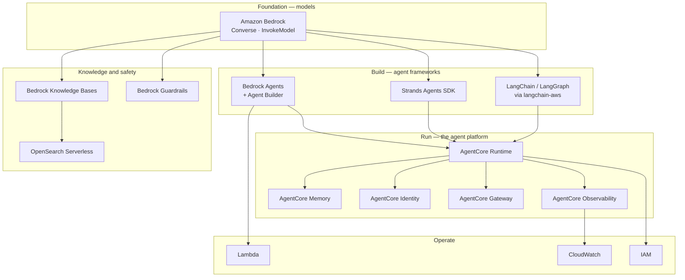

# Where AWS Comes Into the Picture

Every [portable concept](genai-core-concepts.md) has an AWS surface. This page is the map between them:
what each service does, which module teaches it, and what it replaces if you were building it yourself.

---

## The stack, bottom to top

---

## Service by service

| AWS service | What it gives you | Replaces (if hand-built) | Module |
| --- | --- | --- | --- |
| **Bedrock — Converse API** | One API across every model family, with tool use and token accounting built in | Per-vendor SDKs and message formats | [02](../../modules/02-bedrock-essentials/) |
| **Bedrock — model catalogue** | Claude, Nova, Llama, Mistral and others behind one IAM boundary | Vendor contracts and key management | [01](../../modules/01-llm-and-aws-bridge/) |
| **Bedrock Knowledge Bases** | Managed ingestion, chunking, embedding and retrieval | Your own RAG pipeline | [02](../../modules/02-bedrock-essentials/), [04](../../modules/04-agent-builder-and-knowledge-bases/) |
| **Bedrock Guardrails** | Declarative content and topic policy, applied at inference | Prompt-based filtering you have to test yourself | [02](../../modules/02-bedrock-essentials/), [04](../../modules/04-agent-builder-and-knowledge-bases/) |
| **Bedrock Agents** | A managed agent loop with action groups and tracing | The loop you write in Module 05 | [03](../../modules/03-bedrock-agents/) |
| **Agent Builder** | Low-code agent composition | Boilerplate wiring | [04](../../modules/04-agent-builder-and-knowledge-bases/) |
| **Strands Agents SDK** | Open-source agent framework, AWS-native but portable | Hand-rolled loop, tool dispatch, multi-agent primitives | [05](../../modules/05-agent-loop-no-framework-to-strands/)–[07](../../modules/07-strands-multi-agent-patterns/) |
| **AgentCore Runtime** | Agents deployed as invocable services | Your own container platform | [11](../../modules/11-bedrock-agentcore/) |
| **AgentCore Memory** | Managed session and long-term memory | Your own store and retention policy | [11](../../modules/11-bedrock-agentcore/) |
| **AgentCore Identity** | Scoped credentials for agents and their tools | Bespoke secret plumbing | [11](../../modules/11-bedrock-agentcore/) |
| **AgentCore Gateway** | A front door with routing and tool exposure | Your own API layer | [11](../../modules/11-bedrock-agentcore/), [14](../../modules/14-end-to-end-production/) |
| **AgentCore Observability** | Traces and metrics for agent runs | Manual logging you will regret | [11](../../modules/11-bedrock-agentcore/), [13](../../modules/13-agentic-qa-and-evaluation/) |
| **OpenSearch Serverless** | Vector and lexical search at scale | Running your own index | [10](../../modules/10-rag-opensearch-litellm/) |
| **Lambda** | The compute behind action groups and tools | A service you host | [03](../../modules/03-bedrock-agents/), [04](../../modules/04-agent-builder-and-knowledge-bases/) |
| **CloudWatch** | Logs, metrics, Logs Insights queries for debugging | Your own observability stack | [13](../../modules/13-agentic-qa-and-evaluation/) |
| **IAM** | Who and what your agent is allowed to touch | — (there is no substitute) | Throughout |

---

## The three most common AWS-specific mistakes

1. **Missing the inference-profile prefix.** `anthropic.claude-...` versus `us.anthropic.claude-...`.
   Cross-region inference profiles need the regional prefix, and the error message does not make this obvious.
2. **Wrong Bedrock client.** `bedrock` manages models and configuration. `bedrock-runtime` invokes them.
   `bedrock-agent` and `bedrock-agent-runtime` split the same way for agents.
3. **Model access not requested.** Access is granted per model, per region, on request — an empty model list
   is a permissions state, not an outage.

Full troubleshooting list: [`docs/setup/troubleshooting.md`](../setup/troubleshooting.md).

---

**Next:** [What transfers off AWS](portability-matrix.md) &nbsp;·&nbsp; [Glossary](glossary.md)
