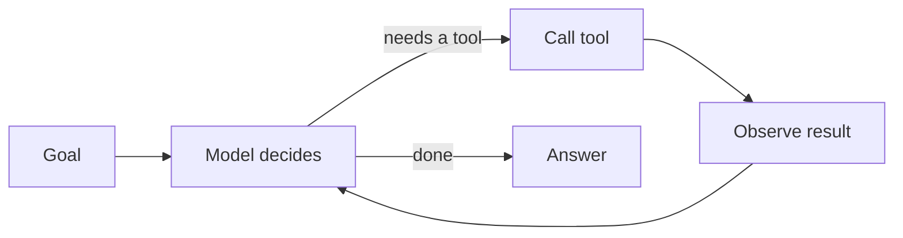

# Portable GenAI Concepts

Everything on this page is true regardless of cloud, vendor or framework. Learn it once and it
transfers to Azure, GCP, a self-hosted model, or whatever replaces them. The
[AWS service map](aws-service-map.md) is the other half of the picture.

---

## 1. The model is a next-token predictor

A language model takes a sequence of tokens and predicts the next one, conditioned on everything before it.
It repeats that until a stop condition. There is no lookup, no database, no reasoning engine underneath —
the apparent reasoning is a side effect of prediction at scale.

**Why it matters practically:** the model has no memory, no ability to act, and no source of truth.
Every one of those is something *you* engineer around it.

## 2. Tokens are the unit of everything

Tokens are the unit of cost, of latency, and of the context limit. Roughly 0.75 words per token in English,
but that ratio collapses for code, JSON and non-Latin scripts.

| You are charged for | Which means |
| --- | --- |
| Input tokens | Your prompt, your history, your retrieved context, your tool schemas |
| Output tokens | Everything the model writes, including reasoning you discard |

A chatty agent is not a style problem. It is a line item. See
[Module 03's verbosity tax exercise](../../modules/03-bedrock-agents/exercises/verbosity_tax_exercise.md).

## 3. The context window is a budget, not a container

Everything the model can "see" on a turn lives in the context window: system prompt, tool definitions,
conversation history, retrieved documents, and the current message. It is a fixed budget you allocate.

Two failure modes follow:
- **Overflow** — you exceed the window and something gets silently dropped.
- **Dilution** — you fill the window with marginal content and the signal gets lost in the middle.

## 4. The agent loop

An agent is a loop, not a model call:

That is the whole idea. Frameworks differ in ergonomics, not in this shape. You write it by hand in
[Module 05](../../modules/05-agent-loop-no-framework-to-strands/) precisely so no framework can mystify you later.

## 5. Tools are a contract with the model

The model never sees your function. It sees a name, a description and a JSON schema. If a tool is called
wrongly, the schema was wrong first. Write descriptions for the model, not for your teammates.

## 6. Memory is a decision, not a feature

The model is stateless. Every memory strategy is a choice about what to keep and what to pay for:

| Strategy | Keeps | Costs | Loses |
| --- | --- | --- | --- |
| Buffer | Recent turns verbatim | Grows linearly | Anything past the cut |
| Summary | A compressed rolling summary | A summarisation call | Detail, unpredictably |
| Vector | Retrievable past fragments | Storage + retrieval | Recency and ordering |

Covered in depth in [Module 09](../../modules/09-llm-memory/).

## 7. Retrieval grounds the model in your data

RAG is: find relevant text, put it in the context window, ask the model to answer from it. Everything hard
is in "find relevant" — chunking, embedding, hybrid retrieval, fusion, reranking — and in proving it worked.
[Module 10](../../modules/10-rag-opensearch-litellm/) covers the whole pipeline.

## 8. Multi-agent is a topology decision with a bill

| Pattern | Use when | Costs you |
| --- | --- | --- |
| Single agent | The task fits one context and one skill set | Nothing extra |
| Delegation | Clear sub-tasks with clean interfaces | Context re-sent per handoff |
| Critique / reflection | Quality matters more than latency | 2× or more calls |
| Swarm | Parallel exploration of an open problem | Unbounded without a stop rule |
| Graph | The control flow is genuinely known upfront | Rigidity |

Adding agents does not fix a bad prompt. It multiplies it.

## 9. Evaluation is the only thing standing between you and production

Non-deterministic systems cannot be tested with equality assertions alone. You need a golden set that
represents real usage, metrics you agreed before you measured, and a gate that fails the build rather than
warning about it. [Module 13](../../modules/13-agentic-qa-and-evaluation/).

## 10. Guardrails are policy, and policy needs testing

A guardrail you never attacked is a guardrail you do not have.

---

**Next:** [How AWS implements all of this](aws-service-map.md) &nbsp;·&nbsp;
[What transfers off AWS](portability-matrix.md) &nbsp;·&nbsp; [Glossary](glossary.md)
