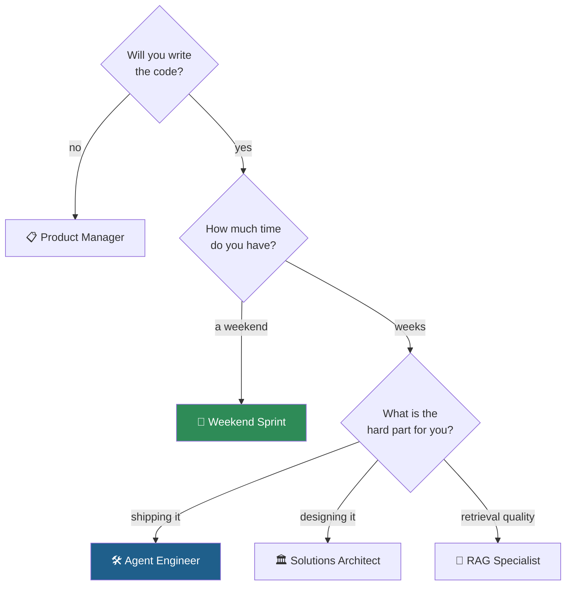

# Learning Paths

Sixteen modules is a lot. Nobody needs all of them in the same order. Pick the path that matches why you
are here — each one is a specific subset, in a specific sequence, with a stated finish line.

| Path | For | Time | Finish line |
| --- | --- | --- | --- |
| 🚀 **[Weekend Sprint](weekend-sprint.md)** | "Show me it works, this weekend" | ~12 h | A working Bedrock agent with tools |
| 🛠️ **[Agent Engineer](agent-engineer.md)** | Building and shipping agents | ~70 h | A deployed, evaluated, gated agent |
| 🏛️ **[Solutions Architect](solutions-architect.md)** | Designing and reviewing agent systems | ~45 h | A defensible architecture with a cost model |
| 📋 **[Product Manager](product-manager.md)** | Deciding what to build and defending it | ~25 h | A PRD and a gate review you can run |
| 🔬 **[RAG Specialist](rag-specialist.md)** | Retrieval quality as the job | ~35 h | A measured, gated RAG pipeline |

---

## If you are not sure

## Ground rules that apply to every path

1. **Attempt exercises closed-book.** Solutions are written to be read *after* you have a wrong answer to
   compare against. Reading them first converts an hour of learning into five minutes of nodding.
2. **Fill in the workbooks.** The `.xlsx` activities are where a decision gets written down and costed.
   Skipping them is how you end up unable to defend the design later.
3. **Do not skip Module 05.** Writing the agent loop by hand is what stops every later framework from
   being magic.
4. **Watch the bill.** Set a budget alarm before Module 02. See [cost controls](../setup/cost-controls.md).

## Tracking your progress

Fork the repo and tick off modules as you go, or use the
[public project board](https://github.com/akash-coded/aws-bedrock-agentcore-strands/projects) which mirrors
these paths as issues you can copy into your own board.
