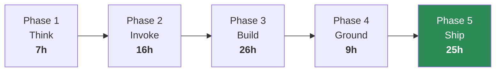

# 🛠️ Agent Engineer

**For:** you will build and operate agents. **Time:** ~70 hours. **Finish line:** an agent deployed on
AgentCore, evaluated against a golden set, behind a gate that can block your own release.

This is the full curriculum in its intended order. Everything else is a subset of it.

## Phase 1 · Think — 7 h

| Module | Why it is here |
| --- | --- |
| [00 Agentic Foundations](../../modules/00-agentic-foundations/) | Decide whether this should be an agent at all |
| [01 LLM and AWS Bridge](../../modules/01-llm-and-aws-bridge/) | Model intuition, and the model-ID rules that will bite you |

**Gate:** you have a filled PRD and a token budget for something you actually want to build.

## Phase 2 · Invoke — 16 h

| Module | Why it is here |
| --- | --- |
| [02 Bedrock Essentials](../../modules/02-bedrock-essentials/) | Converse, tools, KBs, guardrails — the base layer |
| [03 Bedrock Agents](../../modules/03-bedrock-agents/) | The managed loop, and how to see inside it |
| [04 Agent Builder and KBs](../../modules/04-agent-builder-and-knowledge-bases/) | Low-code surface and where its ceiling is |

**Gate:** a Bedrock agent with a Lambda-backed action group, and you can read its trace.

## Phase 3 · Build — 26 h

| Module | Why it is here |
| --- | --- |
| [05 No Framework to Strands](../../modules/05-agent-loop-no-framework-to-strands/) | Write the loop before you let anything hide it |
| [06 Strands Foundations](../../modules/06-strands-foundations/) | Tools, memory, MCP |
| [07 Multi-Agent Patterns](../../modules/07-strands-multi-agent-patterns/) | Topologies and their cost |
| [08 LangChain and LangGraph](../../modules/08-langchain-and-langgraph/) | The ecosystem in most existing codebases |
| [09 LLM Memory](../../modules/09-llm-memory/) | What your agent forgets, deliberately |

**Gate:** the same task built in both Strands and LangChain, with a written one-sentence trade-off each way.

## Phase 4 · Ground — 9 h

| Module | Why it is here |
| --- | --- |
| [10 RAG, OpenSearch, LiteLLM](../../modules/10-rag-opensearch-litellm/) | Retrieval that you can prove works |

Take the core path through Module 10: labs 01, 03, 04, 05, 06. Labs 02, 07 and 08 are for the
[RAG Specialist path](rag-specialist.md).

**Gate:** your evaluation gate fails on a deliberately degraded index.

## Phase 5 · Ship — 25 h

| Module | Why it is here |
| --- | --- |
| [11 AgentCore](../../modules/11-bedrock-agentcore/) | Runtime, memory, identity, gateway, observability |
| [12 A2A and A2UI](../../modules/12-a2a-and-a2ui-interop/) | Interop, when it is worth the hop |
| [13 QA and Evaluation](../../modules/13-agentic-qa-and-evaluation/) | The gate with teeth |
| [14 End-to-End Production](../../modules/14-end-to-end-production/) | Build, deploy, fail over, roll back |

**Finish line:** [Capstone · RailReserve](../../modules/14-end-to-end-production/exercises/Capstone_RailReserve.md)
— a full agent build in a new domain, taken through the gate.

## If you are short on time

Drop, in this order: Module 12 (interop is situational) → Module 04 (low-code is optional if you write
code) → Module 08 (only if you will never touch a LangChain codebase). Never drop 05, 13 or 14.
