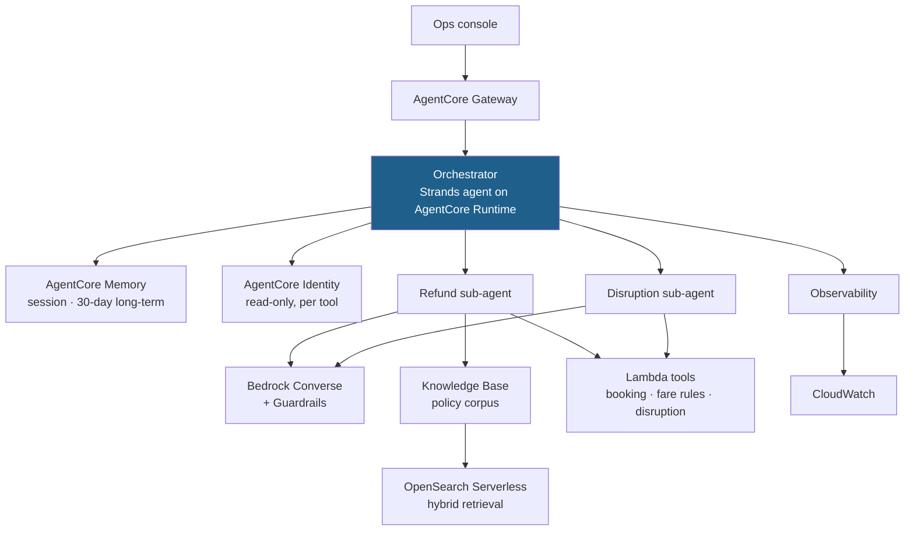

# 03 · Technical Design — TravelMind

> How it is built, what it costs, and what breaks. Follows the shape of the
> [LLD pages](../architecture/lld/).

**Status:** baseline · **Owner:** Engineering

## Architecture

## Component decisions

| Decision | Chosen | Rejected | Why |
| --- | --- | --- | --- |
| Framework | Strands | LangGraph | Team is AWS-native; no existing LangChain codebase to match |
| Topology | Delegation (orchestrator + 2 specialists) | Swarm | Sub-tasks are known and bounded; swarm has no stop rule here |
| Retrieval | Hybrid lexical + dense with RRF | Dense only | Policy text is full of exact terms — fare classes, clause numbers — which lexical search finds and embeddings blur |
| Reranking | Yes, top-20 → top-5 | No rerank | Measured: +14 points recall@5 on the golden set. Kept because measured, not assumed |
| Runtime | AgentCore Runtime | Self-managed containers | Identity, memory and observability come with it |
| Memory | AgentCore Memory, 30-day TTL | Unbounded | Storage cost, and 30 days covers the audit window |

Topology choice recorded in the
[pattern selector](../../modules/06-strands-foundations/activities/MultiAgent_Pattern_Selector.xlsx).

## Data flow

Follows the [HLD request lifecycle](../architecture/README.md#4-request-lifecycle). Two points specific
to TravelMind:

1. **Policy retrieval happens in the sub-agent, not the orchestrator.** The orchestrator never sees policy
   text, which keeps its context small and its cost flat as the corpus grows.
2. **Citations propagate up unchanged.** The orchestrator may not paraphrase a citation, because a
   paraphrased citation cannot be checked.

## Cost model

| Driver | Estimate | Control |
| --- | --- | --- |
| Tokens per turn | System prompt + 4 tool schemas + up to 5 policy passages | Passage cap; short instructions |
| Turns per enquiry | 3–5 | Delegation; no critique loop in v1 |
| Retrieval | top-20 retrieve, top-5 after rerank | Fixed caps |
| Runtime + memory | Per-session, 30-day retention | TTL |

Modelled in the
[AgentCore cost and capacity workbench](../../modules/11-bedrock-agentcore/activities/AgentCore_Cost_and_Capacity_Workbench.xlsx).

## Security

- All tools are read-only. The agent cannot move money because nothing it can call moves money.
- Identity is scoped per tool, not per agent — see the
  [Module 11 LLD](../architecture/lld/11-bedrock-agentcore.md).
- PII beyond the booking reference is blocked at the guardrail.
- Policy corpus is the only knowledge source; no open web access.

## Failure modes

| Failure | Consequence | Detection | Response |
| --- | --- | --- | --- |
| Policy index stale | Confident answer from withdrawn policy | Ingestion freshness check in the gate | Block release |
| Citation missing | Ungrounded claim reaches an ops agent | Contract test | Fail the build |
| Booking API down | Agent cannot verify the case | Tool error | Abstain and hand off |
| Model failover | Quality may drop | Answering model logged per response | Alert; compare against golden set |
| Context overflow on long enquiries | Silent truncation | Token count per turn | Cap history; summarise |

## Rollback

Version manifest carries model, prompt version and image digest. Previous manifest is deployable without a
rebuild — see [Module 14](../../modules/14-end-to-end-production/src/version_manifest.json).

---

**Next:** [evaluation plan](04-evaluation-plan.md)
