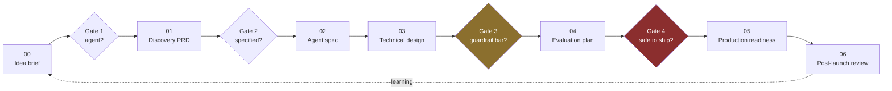

# Sample PRDs — the artefact ladder

Seven artefacts, in the order a real agentic build produces them. Each one is a **worked example** for
TravelMind — the running case study in this curriculum — not an empty template. Copy one, replace the
content, keep the shape.

| # | Artefact | Answers | Owner | Written when |
| --- | --- | --- | --- | --- |
| 00 | [Idea brief](00-idea-brief.md) | Is this worth a week of anyone's time? | Product | Before any commitment |
| 01 | [Discovery PRD](01-discovery-prd.md) | Should this be an agent, and what would good look like? | Product + Architect | After Gate 1 |
| 02 | [Agent spec](02-agent-spec.md) | What exactly does it do, with what tools and limits? | Product + Engineering | Before build |
| 03 | [Technical design](03-technical-design.md) | How is it built, and what does it cost? | Engineering | Before build |
| 04 | [Evaluation plan](04-evaluation-plan.md) | How do we know it works, and what blocks release? | Engineering + QA | Alongside build |
| 05 | [Production readiness](05-production-readiness.md) | Is it safe to release, and how do we undo it? | Engineering | Before Gate 4 |
| 06 | [Post-launch review](06-post-launch-review.md) | What did we get wrong, and what changes next time? | Everyone | 30 days after release |

## How these connect to the modules

| Artefact | Built with |
| --- | --- |
| 00, 01 | [Module 00](../../modules/00-agentic-foundations/) — classifier, failure diagnostic, PRD builder |
| 02 | [Module 00](../../modules/00-agentic-foundations/) + [Module 06](../../modules/06-strands-foundations/) tool catalogue |
| 03 | [Architecture LLDs](../architecture/lld/) + [Module 11](../../modules/11-bedrock-agentcore/) cost workbench |
| 04 | [Module 13](../../modules/13-agentic-qa-and-evaluation/) — golden sets and the gate |
| 05 | [Module 14](../../modules/14-end-to-end-production/) — readiness checklist, release pipeline |
| 06 | [Module 15](../../modules/15-agentic-product-lifecycle/) — gate reviews |

## The one rule

**Every artefact must be attackable.** If a reviewer cannot disagree with it on specifics, it is decoration.
"Improve customer experience" is decoration. "Resolve 60% of refund enquiries without human handoff, at
under $0.04 per resolved enquiry" is a claim someone can argue with — and therefore a claim worth writing.
