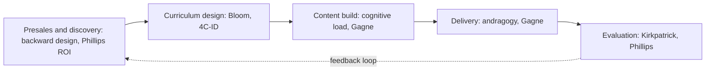

# Training Frameworks Playbook
### Built for how you actually build and deliver

You already run about 70% of this on instinct. Eight years of cohort delivery does that. The frameworks give you three things instinct does not:

- **Shared language** with CXOs and consultant orgs who want to hear method, not vibes.
- **A checklist** that catches your specific failure modes: scope creep, passive watching, late visuals, claims stated before they are verified.
- **Defensible decisions.** When a client asks "why this structure," you answer with a reason, not a preference.

Read each framework as: what it is, where it bites for you, how to build it, how to say it in the room.

The spine, mapped to your pipeline:

---

## 1. Backward Design (start here, it is your scope-creep fix)

**What it is.** Design in reverse. Wiggins and McTighe. Three steps, in this order:

1. What should they be able to DO at the end.
2. What evidence proves they can do it.
3. What teaching and practice produces that evidence.

Most people, including good trainers, design forward: "what topics do I cover." That is how the Day-7 session lost its headline. You designed content-forward (Lambda, IAM, parser) and the outcome ("invoke the agent from code") fell off the table.

**Where it bites for you.** Your permission-boundary and custom-parser detours were content with no outcome attached. Backward design would have killed them on sight, because neither served the day's can-do statement.

**Build it.**
- Write one can-do line per session at the top of your own notes. Day-7 should have read: *"Every learner invokes their Bedrock agent from a Python script and handles the loop."*
- Anything not serving that line is a parking-lot item, not a teaching item.
- Build the assessment before the slides. If the proof is "they run `invoke_agent` and fix a loop," build that first, then work backward.

**Say it (discovery call).**
- Say: *"Before we talk curriculum, tell me what your engineers should be able to do in 60 days that they cannot do today."*
- Not: *"Let me walk you through our 13-module syllabus."*
- The client's answer becomes your scope contract. It is also how you stop a client bolting on ten extra topics: every add must map to an outcome they will pay to measure.

**Skeptic's catch.** Backward design is rigid if outcomes are vague. "Understand AI" is not an outcome. Force the verb: build, debug, ship, decide.

**Takeaways.**
- One can-do line per session, written before any slide.
- Assessment is designed second, content third.
- In presales, the client's outcome is your scope fence.

---

## 2. Bloom's Taxonomy (the cognitive level dial)

**What it is.** A ladder of cognitive demand. Revised version, low to high: Remember, Understand, Apply, Analyze, Evaluate, Create. The verb you choose sets the level, and the level sets the difficulty.

**Where it bites for you.** Your bootcamp lives at Apply, Analyze, Create (build agents, debug loops, design tool schemas). Good. The risk is assessment drift: teaching at Create but testing at Remember, like an MCQ asking "what is a Lambda." Your IIT-GN WPS and 8-dimension rubric are strong precisely because they test Apply and above, not recall.

**Build it.**
- Tag every objective, exercise, and quiz item with its Bloom verb. Then check the ramp: do you climb the ladder across the week, or sit on one rung.
- Your embedded anti-patterns (missing `us.` prefix, role-mixing, forgetting to append the assistant tool-use message, wrong Bedrock client type) are Analyze and Evaluate items. Use them to push assessment up the ladder, not just Apply.

**Say it.**
- Say: *"Each module ends with a can-do at the right cognitive level, so your people ship with the skill, not just recognize the term."*
- Not: *"We use Bloom's taxonomy."* Clients do not buy taxonomies, they buy capability.

**Skeptic's catch.** Bloom verbs become theater if you paste them on slides and still run lecture-then-MCQ. The level is set by what learners DO, not by the verb in your objective.

**Takeaways.**
- Match assessment level to teaching level, every time.
- Climb the ladder across a week, do not camp on "Understand."
- Your anti-patterns are ready-made high-Bloom items.

---

## 3. Andragogy (who you are actually teaching)

**What it is.** Knowles' adult-learning principles. Adults:
- Bring experience and resent it being ignored.
- Are problem-centered, not subject-centered.
- Want to know why before what.
- Are self-directed and want some control.
- Are driven by internal motivation (career, mastery), not grades.

**Where it bites for you.** Your FDE Academy cohort includes 20-year VPs and founders. Your room is senior Spring Boot engineers who interrogate you. The API Gateway and auth questions around the 48-minute mark were them testing whether you know production. Lecture that room like freshers and you lose it in ten minutes.

**Build it.**
- Open with the problem, not the theory. Day-7's loop failure was a perfect andragogical hook: real, painful, theirs.
- Mine their experience: "you are from Spring Boot, so you already deploy APIs on EC2, Lambda removes that step." You did this and it landed.
- Give them control: choice of which use case to build, optional deep-dive tracks.

**Say it.**
- Say: *"Your people are experienced. The program is problem-first and activity-driven, it draws on what they already know, it does not lecture them."*
- This is exactly the language Professor Rahman wanted in the FDE call ("not just a job dump, activity-driven"). Andragogy is the rationale behind your own pitch.

**Skeptic's catch.** Andragogy is a posture, not a hard theory, and some adult-versus-child claims are softer than they sound. Use it to set tone, not as a law.

**Takeaways.**
- Problem first, theory second, for senior rooms especially.
- Pull their domain experience into every concept.
- "Problem-first and activity-driven" is your strongest presales line. That line is andragogy.

---

## 4. Cognitive Load Theory (why slides and exercises overload)

**What it is.** Sweller. Working memory is small and fixed. Three loads compete for it:

$$\text{CL}_{\text{total}} = \text{CL}_{\text{intrinsic}} + \text{CL}_{\text{extraneous}} + \text{CL}_{\text{germane}} \le \text{WM}_{\text{capacity}}$$

- **Intrinsic:** difficulty baked into the topic. Agentic loops are genuinely hard. You manage this by sequencing.
- **Extraneous:** load from bad presentation, like cluttered slides, split attention, or explaining a visual concept with words only. You eliminate this.
- **Germane:** the good load of actually building mental schemas. You maximize this inside the budget.

**Where it bites for you.** The 25-minute verbal parser explanation was pure extraneous load: a diagrammatic concept delivered as speech, with the visual sent as pre-read *afterward*. Working memory could not hold it.

Three results worth baking in:
- **Worked-example effect.** Novices learn more from studying a fully worked solution than from solving cold.
- **Completion effect.** Next, give a half-finished solution to complete.
- **Expertise reversal effect.** What helps novices bores experts. Fade scaffolding as skill grows. Your seniors need less hand-holding than IIT-GN freshers, so do not run identical scaffolding for both.

**Build it (your highest-ROI content change).** Restructure every exercise as a three-step fade:
1. **Worked example:** a complete, annotated `invoke_agent` script they read and run.
2. **Completion problem:** the same script with the loop-control logic blanked out, they fill it.
3. **Independent problem:** a new use case, built from scratch.

Right now your exercises likely jump straight to step 3. Adding steps 1 and 2 is the single biggest quality lift available to you.

Slide rules: one idea per slide, never narrate a diagram you have not shown, and use your burnt-amber accent as a signal (highlight the one thing that matters), not decoration. Colour with no meaning is extraneous load.

**Say it.**
- Say: *"We scaffold from worked examples to independent build, so difficulty ramps and nobody drowns."*

**Skeptic's catch.** Cognitive load is hard to measure precisely, and germane load is a contested category. Do not over-theorize it. The practical moves (worked examples, declutter, show-then-tell) are what matter.

**Takeaways.**
- Kill extraneous load: show the diagram before you talk, one idea per slide.
- Worked example, then completion, then independent. Every exercise.
- Fade scaffolding for senior cohorts. Expertise reversal is real.

---

## 5. Gagné's Nine Events of Instruction (session structure)

Gagné, pronounced gan-YAY, not Gangnam. **What it is.** A nine-step sequence for any lesson:

1. Gain attention
2. State the objective
3. Recall prior learning
4. Present the content
5. Provide guidance
6. Elicit performance (they do it)
7. Give feedback
8. Assess
9. Enhance retention and transfer

**Where it bites for you.** You nail event 3 (your callbacks to the while-loop) and event 5 (guidance). You are weak on event 1 (you open with agenda, not hook), event 6 (the watch-the-instructor problem), and event 7 (your answer keys can do more).

**Build it.**
- Event 1: open each module with a failure or a stakes question, not the agenda. "Watch this agent burn 50 loops and cost real money" beats "Today we cover Lambda."
- Event 6: a working checkpoint every 30 to 40 minutes. They build, not just watch.
- Event 7: answer keys explain WHY and show the common wrong path. Your anti-patterns are the feedback content. "Here is what most people get wrong and why" is event 7 gold.

**Say it.** This one is internal, not presales. It is your session-build checklist.

**Skeptic's catch.** Nine events recited rigidly feels robotic. Treat it as a checklist to verify nothing is missing, not a script.

**Takeaways.**
- Open with a hook, not an agenda (event 1).
- Elicit performance every 30 to 40 minutes (event 6).
- Answer keys explain why and show the wrong path (event 7).

---

## 6. 4C/ID (how to teach complex skills like agentic dev)

**What it is.** Van Merriënboer's model for whole, complex skills. The opposite of teaching fragmented pieces and hoping they integrate. Four components:

1. **Learning tasks:** whole, authentic tasks, ordered easy to hard.
2. **Supportive information:** the theory and mental models behind the tasks.
3. **Procedural information:** just-in-time how-to steps, at the moment of need.
4. **Part-task practice:** drilling sub-skills that must become automatic.

The key rule: tasks move from high support to no support as the learner improves.

**Where it bites for you.** Agentic development is a whole-task skill. Teaching IAM, then Lambda, then parser, then code as isolated lectures and hoping learners assemble an agent is the exact anti-pattern 4C/ID warns against. Your TravelMind use case running across days is already 4C/ID instinct: one whole task, increasing complexity. Make it explicit.

**Build it.**
- Spine the week on one whole task (TravelMind), increasing complexity each day: UC-A1 booking lookup, then UC-A2 disruption replanning, then add the booking tool that kills the loop, then guardrails, then multi-agent.
- Supportive information (how the orchestrator loops) is taught around the task, not as a standalone lecture.
- Procedural information (the exact `invoke_agent` call) is given at the keyboard, not 40 minutes earlier.
- Part-task practice: schema writing, message-array appending. Drill the bits that must be automatic, including your anti-patterns.

**Say it.**
- Say: *"They build one realistic system that grows in complexity all week, with support that fades, so they finish able to build independently, not just follow along."*
- That is your "they ship real things" promise, with a method behind it.

**Skeptic's catch.** Full 4C/ID is heavy to design. You do not need the academic version. You need the whole-task spine plus fading support. Borrow the principle, not the paperwork.

**Takeaways.**
- One whole task per program, growing in complexity. You do this, so name it.
- Theory around the task, how-to at the moment of need.
- Support fades to zero by the capstone.

---

## 7. Kirkpatrick and Phillips (evaluation, and the CXO money conversation)

**What it is.** Kirkpatrick's four levels, plus Phillips' fifth:

1. **Reaction:** did they like it (smile sheets).
2. **Learning:** did they gain skill (your WPS, tests, rubric).
3. **Behavior:** did they change on the job (60 to 90 days later).
4. **Results:** did the business outcome move.
5. **ROI, Phillips:** was the rupee return worth the spend.

$$\text{ROI}\,(\%) = \frac{\text{Benefits} - \text{Costs}}{\text{Costs}} \times 100$$

**Where it bites for you.** Your IIT-GN WPS (Assignment 30, Hands-on 25, CC 20, Engagement 10, Communication 15) is a solid Level 2 instrument. Most vendors stop at Level 1. You can credibly promise Levels 3 and 4, and that is what separates a premium program from a commodity bootcamp in a CXO's eyes.

**Build it.**
- Level 1: a quick post-session pulse, but never confuse a high smile score with learning.
- Level 2: you already do this well.
- Level 3: a 60-day follow-up. Did the engineers actually ship an agent into a workflow. Capture it.
- Level 4 and 5: define the business metric WITH the client up front (tickets deflected, time-to-POC, disruption-handling cost). Then you can quote ROI honestly.

**Say it (your strongest presales weapon).**
- Say: *"Most training measures whether people enjoyed it. We measure four levels: reaction, demonstrated skill, on-the-job behavior at 60 days, and a business metric you define. Let us agree that metric now."*
- A CXO who hears a measurement plan trusts you more than one who hears a syllabus. It also forces the client to commit to an outcome, which fences your scope.

**Skeptic's catch.** Levels 4 and 5 are where vendors hand-wave. Do not claim ROI you cannot attribute. Confounders are everywhere. Promise a measurement *method*, not a fabricated number.

**Takeaways.**
- You already own Level 2. Most competitors never get past Level 1.
- Promise Level 3 and 4 with a method, never a made-up figure.
- Agreeing the business metric up front is both a sales win and a scope fence.

---

## Cross-phase cheat sheet

| Phase | Lead frameworks | The one move |
|---|---|---|
| Presales / discovery | Backward design, Phillips ROI | Ask for the 60-day can-do, agree the business metric |
| Curriculum design | Bloom, 4C/ID | One whole task, climbing Bloom levels |
| Content build | Cognitive load, Gagné | Worked example to completion to independent, hook not agenda |
| Delivery | Andragogy, Gagné | Problem first, elicit performance every 30 to 40 min |
| Evaluation | Kirkpatrick, Phillips | Measure Levels 2 to 4 with method, not smile sheets |

## Upgrade your current artifacts

| Artifact | Framework move | Specific change |
|---|---|---|
| PPTX deck | CLT + Gagné | One idea per slide, open each module with a failure hook, amber as signal only |
| Exercise PDF | CLT worked-example fade | Three steps: worked, completion, independent (your biggest lift) |
| Answer key | Gagné event 7 | Explain why, show the common wrong path using your anti-patterns |
| Activity Excel | CLT germane load | Predict-before-reveal, interactive not read-only, less scaffolding for seniors |
| Mini-project | 4C/ID + backward design | Whole-task spine, fading support, the 8-dimension rubric as the pre-designed assessment |

## Myths to refuse (clients will ask for these)

- **Learning styles / VAK** ("visual versus auditory learners"). No credible evidence. If a client asks, redirect to dual coding: words plus visuals helps everyone, learner "types" do not exist.
- **"We covered it, so they learned it."** Coverage is not learning. Only Level 2 evidence is.
- **Bloom verb theater.** Pasting "analyze" on a slide while running a recall quiz fools no one.
- **Fabricated ROI.** A confident wrong number destroys trust faster than an honest "here is how we will measure it."

## Overall takeaways

- **Backward design is your antidote.** Your one recurring weakness is scope creep born of knowing too much. An outcome-first contract, per session and per program, is the fix. Everything else is secondary.
- **The frameworks are a checklist, not a religion.** You teach well already. Use them to catch your four failure modes (scope, passive watching, late visuals, unverified claims), not to perform method on stage.
- **Translate, never recite.** Inside your design, name the frameworks. In front of a client, speak outcomes and measurement. CXOs buy capability and proof, not pedagogy jargon.
- **One change beats all others this quarter:** convert your exercises to the worked-example fade. Highest evidence, lowest effort, in this entire document.
