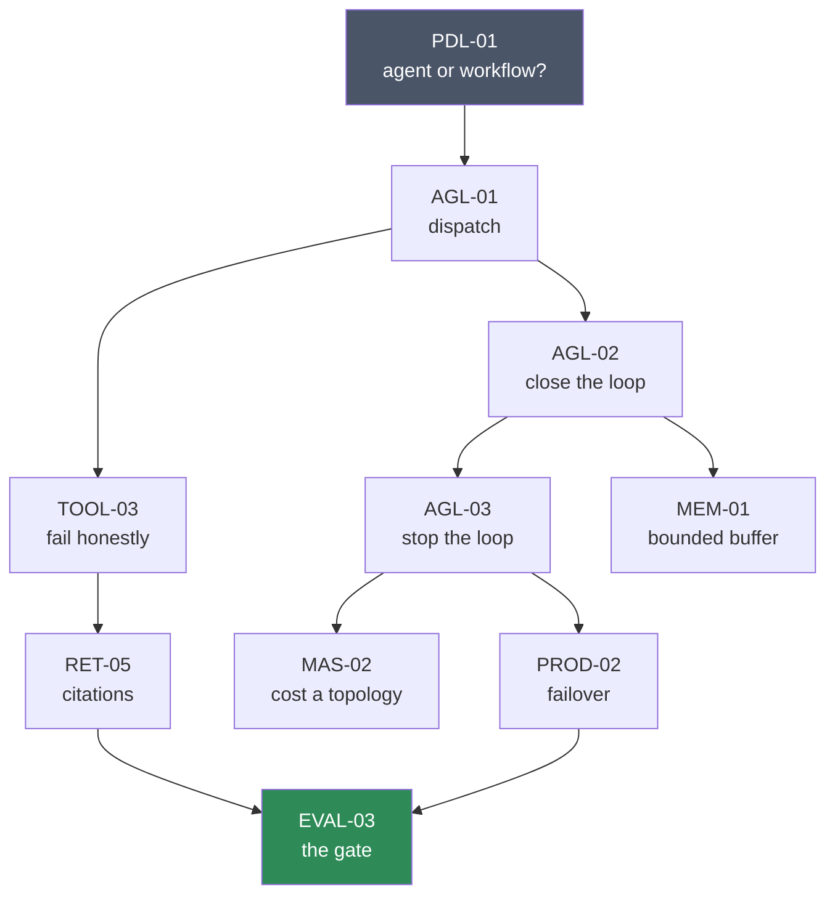
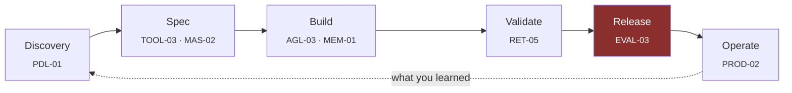

# The Pathway

Forty-one labs, ordered so that each one is possible because of the ones before it. Ten are built; the
rest are specified below and open for contribution.

This page explains **why** the order is what it is. If you just want to start, run
`python labs/runner/labctl.py next`.

---

## The shape

Not a line — a directed graph. Several tracks open early and run in parallel, because retrieval and
evaluation do not need to wait for the agent loop.

Four rules produced that graph.

**1. Decide before you build.** [PDL-01](catalog/product/PDL-01/) comes first and needs no code, because
the most expensive mistake in an agentic project is made before anyone opens an editor. It is also the
only lab a product manager needs to do to have an opinion worth arguing with.

**2. Nothing is abstracted before you have built it.** [AGL-01](catalog/agent-loop/AGL-01/) →
[AGL-02](catalog/agent-loop/AGL-02/) → [AGL-03](catalog/agent-loop/AGL-03/) is the agent loop, by hand, in
three bites. A framework introduced before this is magic; after it, it is ergonomics.

**3. Failure honesty precedes grounding.** [TOOL-03](catalog/tools/TOOL-03/) comes before
[RET-05](catalog/retrieval/RET-05/) because an uncited answer and a misread empty result are the same bug
wearing different clothes. Learn the shape once, on the simpler case.

**4. The gate comes last and depends on the most.** [EVAL-03](catalog/evaluation/EVAL-03/) is the only lab
whose subject is *refusing*. It sits downstream of retrieval and production because you cannot write
meaningful thresholds for a system you have not built.

---

## Difficulty means something specific

Not "how much code". Difficulty here is **how much judgement the lab withholds**.

| | The lab tells you | You supply |
| --- | --- | --- |
| `easy` | The rule, and the shape of the answer | The implementation |
| `medium` | The requirements, and the trade-offs | The decision, and its consequences |
| `hard` | The situation | The requirements, the decision, and the evidence it was right |

[AGL-01](catalog/agent-loop/AGL-01/) is easy and has 15 checks. [MAS-02](catalog/multi-agent/MAS-02/) is
medium and is 40 lines of arithmetic. The count of lines is not the variable.

---

## The PDLC thread

The labs are engineering exercises. The **decisions** inside them are product artefacts, and they
accumulate into the [seven PRDs](../docs/prd/) without ever announcing themselves as a product course.

Each `DECISION.md` you write in the workspace is a paragraph of a real document:

| Your decision | Becomes a line in |
| --- | --- |
| The rung this use case needs | [Idea brief](../docs/prd/00-idea-brief.md) |
| What your tools return when they find nothing | [Agent spec](../docs/prd/02-agent-spec.md) |
| Your topology's H×, and what it buys | [Technical design](../docs/prd/03-technical-design.md) |
| What the agent returns when the budget binds | [Technical design](../docs/prd/03-technical-design.md) |
| What a citation asserts, and how you would check it | [Evaluation plan](../docs/prd/04-evaluation-plan.md) |
| Which thresholds are absolute rather than averages | [Production readiness](../docs/prd/05-production-readiness.md) |
| Your failover policy and its signal | [Production readiness](../docs/prd/05-production-readiness.md) |

Finish the pathway and you have a working system **and** the paperwork that would get it through a gate
review. Most people have one or the other.

---

## Routes through it

| If you are… | Do these, in this order |
| --- | --- |
| **New to agents** | PDL-01 → AGL-01 → AGL-02 → AGL-03 → TOOL-03 |
| **A backend engineer** | AGL-01 → AGL-02 → AGL-03 → TOOL-03 → PROD-02 |
| **Working on RAG** | TOOL-03 → RET-05 → EVAL-03 |
| **An architect** | PDL-01 → MAS-02 → PROD-02 → EVAL-03 |
| **A PM or BA** | PDL-01 alone. It needs no code and no cloud account |
| **Preparing for interviews** | AGL-01 → AGL-02 → AGL-03 → EVAL-03 — these four answer more interview questions than the rest combined |

---

## The complete pathway

Ten built (**✅**), thirty-one specified. Specified labs have a title, a difficulty, and a stated teaching
point — enough to author from. See [how to author a lab](CONTRIBUTING-A-LAB.md); the
[extension board](https://github.com/users/akash-coded/projects/6) tracks them.

### 📋 Product & PDLC

| | Lab | Diff | Teaches |
| --- | --- | --- | --- |
| ✅ | **PDL-01** Agent, workflow, or script | easy | The rung a use case actually needs |
| | PDL-02 Derive the abstention target | medium | Your correct "I don't know" rate comes from your traffic, not your model |
| | PDL-03 Cost per *resolved* task | medium | The denominator everyone forgets |
| | PDL-04 Thresholds from the business case | hard | Turning "it should be accurate" into a gate |

### 🔁 Agent Loop

| | Lab | Diff | Teaches |
| --- | --- | --- | --- |
| ✅ | **AGL-01** Dispatch a tool call | easy | Unknown tools are normal, not exceptional |
| ✅ | **AGL-02** Close the loop | easy | Why the tool result is a `user` turn |
| ✅ | **AGL-03** Stop the loop | medium | Oscillation is not the same as exhaustion |
| | AGL-04 Answer honestly after a tool error | medium | An agent told a tool failed will still answer unless told not to |
| | AGL-05 Route the hot path away from the agent | medium | The 40–70% cost cut nobody does first |
| | AGL-06 Cap by token budget, not step count | hard | Six cheap turns and six expensive ones are not the same cap |

### 🔧 Tools

| | Lab | Diff | Teaches |
| --- | --- | --- | --- |
| | TOOL-01 Derive a schema from a signature | easy | The model sees the schema, not your function |
| | TOOL-02 Descriptions the model can disambiguate | easy | Say what a tool is *not* for |
| ✅ | **TOOL-03** Fail honestly: no bare empties | medium | `[]` reads as "nothing applies" |
| | TOOL-04 Validate arguments before calling | medium | Models hallucinate parameter names |
| | TOOL-05 Prune the tool menu per route | hard | Schema tax is charged every turn |

### 🧠 Memory

| | Lab | Diff | Teaches |
| --- | --- | --- | --- |
| ✅ | **MEM-01** A buffer that cannot overflow | medium | Every buffer has an eviction policy; most are accidental |
| | MEM-02 Summarise at a threshold, not a schedule | medium | Scheduled summarisation is a permanent tax |
| | MEM-03 Preserve the decisive fact | hard | Summaries drop the constraint the user cared about |
| | MEM-04 Retention and redaction | medium | Nothing to leak is the strongest control |

### 📚 Retrieval

| | Lab | Diff | Teaches |
| --- | --- | --- | --- |
| | RET-01 Chunk on structure, not size | easy | If the answer straddles a boundary, no retriever wins |
| | RET-02 Why lexical *and* dense | medium | Embeddings blur the exact terms users search for |
| | RET-03 Reciprocal rank fusion | medium | Merge by rank so you never tune score scales |
| | RET-04 Pack to a token budget | medium | `top_k` is not a budget |
| ✅ | **RET-05** Citations that survive verification | medium | A citation that cannot be checked is not grounding |
| | RET-06 Did reranking earn its latency? | hard | Measure it or drop it |
| | RET-07 Find your k | hard | The accuracy curve peaks and then falls |

### 🕸️ Multi-Agent

| | Lab | Diff | Teaches |
| --- | --- | --- | --- |
| | MAS-01 Delegate without losing context | medium | Correct sub-answers, wrong final answer |
| ✅ | **MAS-02** Cost a topology before you build it | medium | The merge call is the one people forget |
| | MAS-03 Terminate a swarm | hard | Unbounded is a spending rate, not a cost |
| | MAS-04 A critique loop that converges | hard | Measure whether round 2 ever changed an outcome |

### 🔬 Evaluation

| | Lab | Diff | Teaches |
| --- | --- | --- | --- |
| | EVAL-01 Score a golden set | easy | Rates on a named set, not pass/fail on a case |
| | EVAL-02 Abstention as a first-class outcome | medium | "Wrong" and "correctly declined" are different results |
| ✅ | **EVAL-03** A gate that can say no | medium | Absolutes are not strict averages |
| | EVAL-04 Calibrate a judge | hard | An unvalidated judge is an uncalibrated instrument |
| | EVAL-05 Invariance under paraphrase | medium | Same question, different words, same answer |
| | EVAL-06 Detect a mirror golden set | hard | A set built from your own output measures nothing |

### 🚀 Production

| | Lab | Diff | Teaches |
| --- | --- | --- | --- |
| | PROD-01 Log the answering model | easy | One field turns a silent failure observable |
| ✅ | **PROD-02** Failover that cannot be silent | medium | Working exactly as designed, and still hurting you |
| | PROD-03 Version manifest and rollback | medium | Four things must roll back together |
| | PROD-04 Detect degradation from a metrics stream | hard | Error rate catches only what you would have noticed |
| | PROD-05 Decompose a red tool | medium | An agent cannot issue a refund it has no tool for |

---

## What "done" looks like

Not all 41. Done is when you can answer these four without looking anything up:

1. **What does your agent do when it does not know?** — and can you point at the code
2. **What does your topology cost, as a multiple of one agent?** — with a number
3. **What would block your release?** — and is it an absolute or an average
4. **How would you know it had quietly got worse?** — name the signal

Every lab exists to make one of those four answerable.

---

[⬅️ L.A.B. Simulator](README.md) · [✍️ Author a lab](CONTRIBUTING-A-LAB.md) ·
[📚 Curriculum](../modules/) · [🧭 Field guide](../cheatsheets/)
