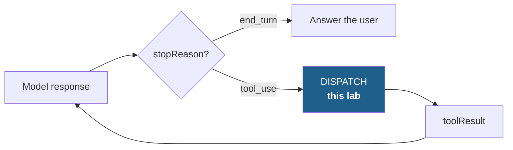

# AGL-01 · Dispatch a tool call

`agent-loop` · **easy** · 20 min · no AWS account needed

---

## L — Learn

An agent is a loop. On each turn the model either answers, or asks for a tool. Everything interesting
lives in what happens between "the model asked" and "the model gets an answer back".



Dispatch looks like a lookup: take the tool name, find the function, call it. It is not, because of one
case the happy path never shows you.

### The decision you have to make

> **The model asks for a tool you do not have. What happens?**

The model does not know your tool registry — it knows the descriptions you sent it, and it will
occasionally invent a neighbour that sounds plausible (`get_refund_status` when you registered
`get_booking_status`). Three options, and they are not equivalent:

| Option | What the model sees next | What it costs you |
| --- | --- | --- |
| **Raise** | Nothing — the loop dies | An exception in production for a recoverable situation |
| **Return an error result** | "That tool does not exist. Available: …" | One wasted turn; the model can self-correct |
| **Skip silently** | Nothing — no result for that call | The model repeats the call, or invents the answer |

Only one of these is defensible. Decide before you write code, and write down why —
[`labs/workspace/AGL-01/DECISION.md`](../../../workspace/) is where it goes.

> Skipping silently is the option that looks harmless and is not. A missing `toolResult` means the model
> asked a question and got no reply; the most common next move is to answer anyway, from nothing.

---

## A — Apply

Implement `dispatch(tool_use, registry)`.

**Input** — a `tool_use` block as the Converse API produces it:

```python
{"toolUseId": "tu_01", "name": "get_booking", "input": {"booking_ref": "XY7Q2M"}}
```

`registry` maps a tool name to a callable.

**Return** — a `toolResult` block, ready to append to the message history:

```python
{"toolResult": {"toolUseId": "tu_01",
                "content": [{"json": {...}}],
                "status": "success"}}
```

**Requirements**

1. Look the tool up by `name` and call it with `**input`.
2. `toolUseId` must be carried through **unchanged**. It is how the model matches reply to request.
3. On success: `status` is `"success"`, the return value goes in `content[0]["json"]`.
4. If the tool raises: `status` is `"error"`, and `content[0]["text"]` explains what happened. **Do not let
   the exception escape** — one failing tool must not kill the loop.
5. If the tool is not in the registry: `status` is `"error"`, and the message must **name the tools that do
   exist**, so the model can correct itself on the next turn.

```bash
python labs/runner/labctl.py start AGL-01
python labs/runner/labctl.py run   AGL-01
python labs/runner/labctl.py submit AGL-01
```

---

## B — Break

```bash
python labs/runner/labctl.py break AGL-01
```

The Break phase runs your dispatcher against the situations that do not appear in any tutorial: a tool
that returns `None`, a tool that raises a `BaseException`, a call whose `input` key is missing entirely,
and a registry entry that is not callable.

A dispatcher that survives all four is one you can put in a loop and leave alone.

---

## What a pass proves

You can turn a model's tool request into a result the loop can continue from, **including when the request
is wrong**. That is the difference between a demo loop and one that runs unattended.

**Next:** [AGL-02 · Close the loop](../AGL-02/) — where the result you just built has to be put back in the
right place, in the right order.

**Field guide:** [Tool Surface Audit](../../../../cheatsheets/frameworks/tool-surface-audit.md) ·
[Bedrock Converse API](../../../../cheatsheets/quick-reference/bedrock-converse.md)
