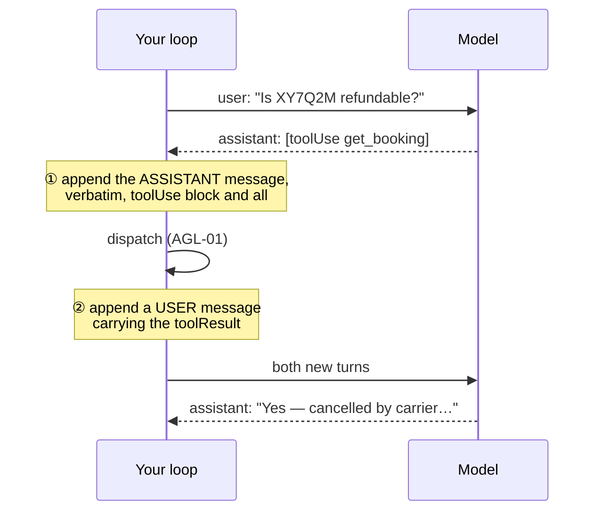

# AGL-02 · Close the loop

`agent-loop` · **easy** · 25 min · prereq [AGL-01](../AGL-01/)

---

## L — Learn

You have a `toolResult`. Now it has to go back into the conversation — and *where* you put it decides
whether the next turn makes any sense to the model.

The full round trip is four messages, not two:



Step ① is the one that gets skipped, and the symptom is strange enough to waste an afternoon: **the model
asks for the same tool again, with the same arguments.** Not a bug in your dispatcher — from the model's
point of view it never asked. Its request was never written down, so the reply it got has nothing to
attach to.

### The decision you have to make

> **The tool result goes in a message. Which role — `assistant` or `user`?**

Intuition says `assistant`: the tool is part of the agent, and the agent is the assistant. Intuition is
wrong here, and the reason is worth holding on to.

The roles do not describe *who acted*. They describe **which side of the conversation the text came from,
from the model's point of view**. The model produced the request; everything that comes back to it is
input. Tool results are input. So: `user`.

Write your reasoning down before you code. If you cannot defend it in a sentence, you will get it wrong
again in six months on a different codebase.

---

## A — Apply

Implement `advance(messages, response, registry)`.

- `messages` — the history so far, a list of `{"role", "content"}`
- `response` — what the model returned: `{"output": {"message": {...}}, "stopReason": str}`
- `registry` — as in AGL-01

**Return** `(messages, done)`:

- `messages` — a **new** list with the right turns appended (do not mutate the caller's list)
- `done` — `True` when `stopReason` is `end_turn`, `False` when there is another turn to take

**Requirements**

1. On `end_turn`: append the assistant message, return `done=True`.
2. On `tool_use`: append the assistant message **verbatim**, then append **one** user message whose
   `content` holds a `toolResult` for **every** `toolUse` block in that response.
3. Roles must alternate. Two consecutive `user` messages are rejected by the API.
4. Order matters: results in the same order the model requested them.
5. Never mutate the input list.

> A model can request several tools in one turn. They belong in **one** user message with several
> `toolResult` blocks — not one message each. Getting this wrong breaks role alternation, which fails at
> the API boundary far from the cause.

You may import your AGL-01 dispatcher, or re-implement it — the starter includes a working copy so this
lab stays about history, not dispatch.

---

## B — Break

```bash
python labs/runner/labctl.py break AGL-02
```

Three turns of history where the model requests two tools at once, one of them fails, and a later turn
references the earlier result. If your history is malformed anywhere, the third turn is where it shows.

---

## What a pass proves

You can keep a conversation the model can actually follow across tool calls — including parallel ones.
This is the single most common source of "the agent repeats itself" in production.

**Next:** [AGL-03 · Stop the loop](../AGL-03/)

**Field guide:** [Failure Signature Catalog](../../../../cheatsheets/frameworks/failure-signature-catalog.md)
rows 1–2 · [Bedrock Converse API](../../../../cheatsheets/quick-reference/bedrock-converse.md#tool-use--the-round-trip-everyone-gets-wrong)
