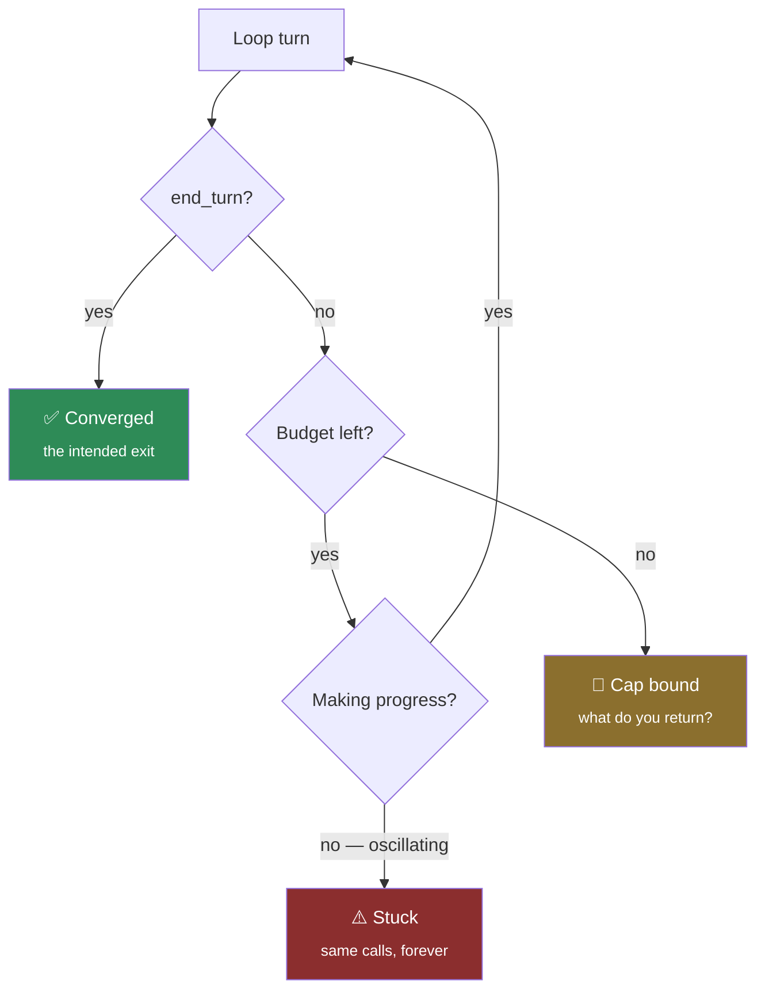

# AGL-03 · Stop the loop

`agent-loop` · **medium** · 30 min · prereq [AGL-02](../AGL-02/)

---

## L — Learn

A loop that cannot stop is not an agent, it is a bill.

There are three ways a loop ends, and only one of them is the one you designed:



**Oscillation** is the one people do not plan for. The model calls `get_booking`, gets a result it cannot
use, calls `get_fare_rules`, gets a result it cannot use, calls `get_booking` again. It is not broken and
it is not converging. Without detection it will burn the whole budget every time.

### The decision you have to make

> **The cap binds. What does the agent return?**

| Option | The caller sees | The problem |
| --- | --- | --- |
| **Best effort** — return whatever text exists | An answer | It is an answer assembled from an unfinished process. Indistinguishable from a real one |
| **Raise** | An exception | Correct-ish, but the caller now handles agent internals |
| **Abstain** — a structured "I could not finish" | An outcome, honestly labelled | One more branch for the caller |

There is a strong default here, and it is the third. A loop that hits its cap has *failed to answer* — and
the whole argument of [AGL-01](../AGL-01/) was that the dangerous move is producing something that looks
like an answer when you have not got one.

Write down your choice. The hidden checks assume you can tell the difference between finishing and
stopping.

---

## A — Apply

Implement `run_loop(messages, model, registry, max_steps=6)`.

`model(messages)` is a callable returning a Converse-shaped response. It is provided in the tests; you
never call a real API.

**Return** a dict:

```python
{"outcome": "answered" | "exhausted" | "stuck" | "failed",
 "answer":  str | None,      # only when outcome == "answered"
 "steps":   int,             # model calls made
 "messages": list,           # the full history
 "reason":  str | None}      # why you stopped, when you did not answer
```

**Requirements**

1. Call the model, advance the history (AGL-02's rules apply), repeat.
2. Stop on `end_turn` → `outcome="answered"`, `answer` is the text.
3. Never exceed `max_steps` model calls → `outcome="exhausted"`.
4. Detect oscillation: **the same set of tool calls requested twice in a row** → `outcome="stuck"`. Stop
   immediately; do not spend the rest of the budget confirming it.
5. `steps` is the number of model calls actually made.
6. If the **model call itself** raises — providers time out, connections drop — that is
   `outcome="failed"`, not a crash. The caller keeps the history and the step count it already paid for.
7. On any non-answer outcome, `reason` explains it in a sentence a human would want in a log line.

> Point 4 is the whole lab. A step cap alone converts a runaway into an expensive runaway. Detecting
> repetition converts it into a cheap, diagnosable one.

---

## B — Break

```bash
python labs/runner/labctl.py break AGL-03
```

A model that never converges. A model that alternates between two tools forever. A model that asks for
zero tools but does not finish. A `max_steps=0`. Each has a right answer and none of them is a crash.

---

## What a pass proves

Your loop terminates for every model behaviour, spends a bounded amount doing it, and tells the caller the
difference between an answer and a surrender.

**Next:** [MEM-01 · A buffer that cannot overflow](../../memory/MEM-01/), or
[MAS-02 · Cost a topology](../../multi-agent/MAS-02/)

**Field guide:** [Cost Cliff Map](../../../../cheatsheets/frameworks/cost-cliff-map.md) cliffs 1–3 ·
[Abstention Budget](../../../../cheatsheets/frameworks/abstention-budget.md) ·
[Runbook · runaway loop](../../../../cheatsheets/runbooks/incident-runaway-loop.md)
