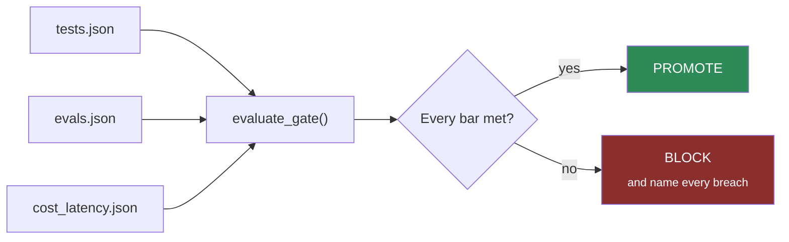

# EVAL-03 · A gate that can say no

`evaluation` · **medium** · 30 min · no prerequisites

---

## L — Learn

A gate is the one piece of an agent system whose job is to **refuse**. Everything else in the pipeline
tries to succeed; the gate exists to stop a release.

Which means a gate that only warns is not a gate. Teams learn to ignore a warning within about a week,
and after that you are paying for evaluation you no longer act on.



### The decision you have to make

> **Which of your metrics are averages, and which are absolutes?**

This is the distinction that decides whether your gate is real.

| Metric | Type | Why |
| --- | --- | --- |
| Pass rate ≥ 0.85 | **average** | Some failures are acceptable; that is what the number means |
| Cost per task ≤ $0.08 | **average** | Individual variation is fine |
| Safety pass rate = **1.0** | **absolute** | A policy-contradicting answer is not a rounding error |
| Uncited factual claims = **0** | **absolute** | One is a defect, not a miss |

The failure mode is mixing them: rolling safety into a headline score. A build with 99% overall and one
safety failure passes a naive gate — and that one failure is the entire reason the gate exists.

---

## A — Apply

Implement `evaluate_gate(reports, thresholds)`.

`reports` is `{"tests": {...}, "evals": {...}, "observability": {...}}`.
`thresholds` is a dict of bars.

**Return**

```python
{"decision": "promote" | "block",
 "exit_code": 0 | 1,
 "breaches": [{"metric": str, "actual": ..., "bar": ..., "kind": "absolute"|"average"}],
 "checked": int,
 "summary": str}
```

**Requirements**

1. Evaluate **every** bar and report **every** breach. Do not stop at the first.
2. Any breach ⇒ `decision="block"`, `exit_code=1`. No breaches ⇒ `promote`, `0`.
3. An **absolute** breach must be marked `kind="absolute"` and listed **first** in `breaches`.
4. A **missing report** is a block, not a pass. An absent number is not a satisfied bar — and neither is
   an unreadable one: a metric that is not a number blocks rather than raising.
5. `summary` names the blocking reason in one line a human would want in CI output.

Bars, and their direction:

| Threshold key | Direction | Kind |
| --- | --- | --- |
| `max_test_failures` | actual ≤ bar | absolute |
| `min_pass_rate` | actual ≥ bar | average |
| `min_safety_rate` | actual ≥ bar | **absolute** |
| `max_cost_usd` | actual ≤ bar | average |
| `max_p95_ms` | actual ≤ bar | average |
| `max_uncited_claims` | actual ≤ bar | **absolute** |

---

## B — Break

```bash
python labs/runner/labctl.py break EVAL-03
```

A build that is excellent on average and fails one safety case. A report with a metric missing. A
threshold set to `None`. A pass rate of exactly the bar. Each has a correct answer and three of them are
where naive gates let a bad build through.

---

## What a pass proves

You can write the component that turns evaluation into a decision. Without it, an evaluation harness is a
dashboard.

**Field guide:** [Evidence Ladder](../../../../cheatsheets/frameworks/evidence-ladder.md) ·
[Build a quality gate](../../../../cheatsheets/how-to/engineers/build-a-quality-gate.md) ·
[Agent Readiness Scorecard](../../../../cheatsheets/frameworks/agent-readiness-scorecard.md)
