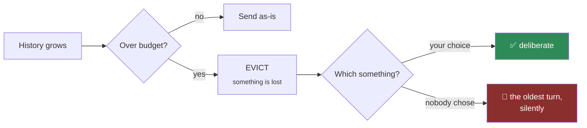

# MEM-01 · A buffer that cannot overflow

`memory` · **medium** · 30 min · prereq [AGL-02](../../agent-loop/AGL-02/)

---

## L — Learn

A conversation buffer that grows without a bound has exactly two futures: it overflows the context window,
or it bankrupts you first. Usually it overflows — and the way it overflows is the problem.

Silent truncation drops the *oldest* turns, which is where the constraint the user stated at the start
lives. The agent does not error. It simply forgets the wheelchair requirement and answers confidently
about a flight it can no longer serve.



### The decision you have to make

> **When the budget is exceeded, what is evicted, and what is never evicted?**

Every buffer has an eviction policy. Most have an *accidental* one. Yours should be written down: which
turns are protected, which are summarised, which are dropped outright.

---

## A — Apply

Implement `trim_history(messages, budget_tokens, summarise, keep_recent=4)`.

- `messages` — the history; each has `role`, `content`, and a precomputed `tokens` (an int)
- `summarise(msgs) -> dict` — provided; collapses messages into one summary message. **It costs a model
  call, so call it at most once.**
- `keep_recent` — this many most-recent messages are never summarised

**Return** `{"messages": [...], "evicted": int, "summarised": bool, "tokens": int}`

**Requirements**

1. If the total is within budget, return unchanged and **do not call `summarise`**.
2. Over budget: keep the last `keep_recent` messages verbatim; summarise everything older into one message
   placed at the front.
3. If it *still* does not fit after summarising, drop the oldest of the recent block until it does — and
   count every drop in `evicted`.
4. **Never drop or summarise the most recent message**, whatever `keep_recent` says. It is the one you
   are answering, and a config value should not be able to delete it.
5. `tokens` is the total of what you return.
6. `summarise` is called at most once, and never when you are under budget.

> Requirement 3 is the case people skip. Summarising is not guaranteed to be enough, and the fallback path
> is where silent truncation creeps back in.

---

## B — Break

```bash
python labs/runner/labctl.py break MEM-01
```

A single message larger than the entire budget. A summary that comes back bigger than what it replaced. A
`keep_recent` larger than the history. Each one breaks a naive implementation in a different way.

**Field guide:** [Context Budget Ledger](../../../../cheatsheets/frameworks/context-budget-ledger.md) ·
[Token Tax Ledger](../../../../cheatsheets/frameworks/token-tax-ledger.md)
