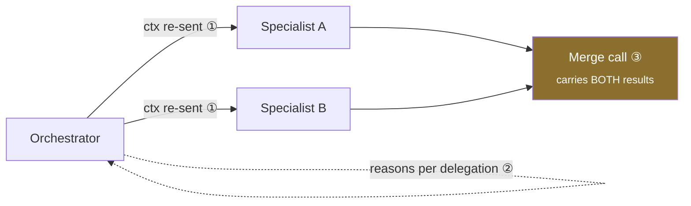

# MAS-02 · Cost a topology before you build it

`multi-agent` · **medium** · 30 min · prereq [AGL-03](../../agent-loop/AGL-03/)

---

## L — Learn

Multi-agent designs are chosen on a whiteboard and paid for in tokens. **H×** is the number that connects
the two:

```
H× = tokens(topology) ÷ tokens(one agent doing the same task)
```

An H× of 3.4 means this shape costs 3.4 times a single agent. That may be entirely worth it — but you
should know the figure before the invoice does.

Three costs are invisible on the diagram:



① **Context re-transmission** — every handoff re-sends the relevant context. This is the dominant term.
② **Orchestrator overhead** — it makes its own model call to decide each delegation.
③ **The merge call** — it carries every specialist's output, so it is the single most expensive call.

The merge is the one people forget, and it is the one that grows fastest with specialist count.

### The decision you have to make

> **What crosses a handoff — the full context, or a summary and an id?**

Passing everything is simpler and makes H× scale badly with specialist count. Passing a summary is cheaper
and risks the specialist missing something the orchestrator judged irrelevant. Choose, and be able to say
what you gave up.

---

## A — Apply

Implement `estimate_topology(spec)`.

```python
{"shape": "single" | "delegation" | "critique" | "swarm",
 "specialists": int,          # 0 for single
 "base_context_tokens": int,  # what a single agent would carry
 "handoff_context_tokens": int,  # what crosses each handoff
 "result_tokens": int,        # each specialist's output
 "orchestrator_turns": int,   # model calls the orchestrator makes itself
 "rounds": int}               # critique rounds / swarm iterations; 1 for others
```

**Return** `{"total_tokens": int, "h_multiple": float, "breakdown": {...}, "warnings": [str]}`

**The model**

```
single:      total = base_context
delegation:  total = base_context                              # orchestrator's own context
                   + orchestrator_turns × base_context         # its reasoning turns
                   + specialists × (handoff_context + result)  # the handoffs
                   + base_context + specialists × result       # the merge call
critique:    delegation with specialists=1, repeated `rounds` times
swarm:       delegation, repeated `rounds` times, no merge until the end
```

**Requirements**

1. `h_multiple` is `total_tokens / base_context_tokens`, rounded to 2 dp.
2. `breakdown` names each component: `orchestrator`, `handoffs`, `merge`.
3. Warn when `h_multiple > 4` — that is a number a reviewer will ask about.
4. Warn when `shape` is `swarm` or `critique` and `rounds` is not explicitly bounded (`rounds <= 0`).
5. `single` always returns `h_multiple == 1.0` and no warnings.

---

## B — Break

```bash
python labs/runner/labctl.py break MAS-02
```

An unbounded swarm. A four-specialist delegation where the merge dominates. A "cheap" topology whose
handoff context is larger than the base. Each is a design that looks reasonable and costs more than the
person proposing it thinks.

**Field guide:** [Handoff Multiplier](../../../../cheatsheets/frameworks/handoff-multiplier.md) ·
[Token Tax Ledger](../../../../cheatsheets/frameworks/token-tax-ledger.md)
