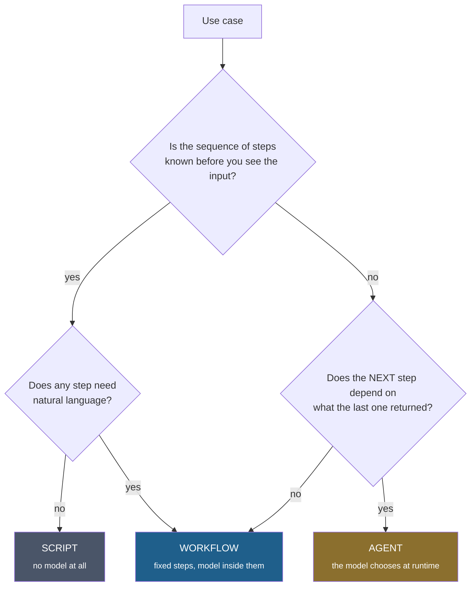

# PDL-01 · Agent, workflow, or script

`product` · **easy** · 25 min · no prerequisites · **no AWS account needed**

---

## L — Learn

The most expensive decision in an agentic project is made before anyone writes code, usually in a meeting,
usually by nobody in particular: *this should be an agent.*

Autonomy is a cost. You pay it in tokens, latency, non-determinism and testing difficulty. You should buy
the least of it that does the job.



The load-bearing question is the first one, and it has a precise form: **can you enumerate the steps now,
before you have seen the input?** Not "is it complicated" — complicated fixed pipelines are workflows.
Runtime *branching on tool output* is what makes something an agent.

### The decision you have to make

> **What is your tie-breaker when a use case sits on the boundary?**

Most real candidates are genuinely borderline. Pick a rule now and apply it consistently:

- **Default down** — when in doubt, build the simpler thing and let it fail. Cheap to discover.
- **Default up** — when in doubt, build the agent. Expensive, and hard to walk back.

There is a defensible answer here and the brief does not give it to you.

---

## A — Apply

Implement `classify(use_case)`.

```python
{"name": "...",
 "steps_known_upfront": bool,     # can you list the steps before seeing input?
 "needs_language": bool,          # does any step need to read or write prose?
 "branches_on_tool_output": bool, # does the next step depend on what came back?
 "hot_path_share": float,         # 0..1 — share of traffic following one common path
 "irreversible_actions": bool}
```

**Return**

```python
{"verdict": "script" | "workflow" | "agent",
 "rung": "R0" | "R1" | "R2" | "R3" | "R4",
 "reasons": [str, ...],          # why, in plain sentences
 "route_hot_path": bool,         # should the common path bypass the agent?
 "warnings": [str, ...]}
```

**Rules**

1. Steps known **and** no language needed ⇒ `script` (`R0`).
2. Steps known **and** language needed ⇒ `workflow` (`R2`).
3. Steps not known but no branching on tool output ⇒ `workflow` (`R2`) — apparent complexity is not
   autonomy.
4. Steps not known **and** branching on tool output ⇒ `agent` (`R3`).
5. `route_hot_path` is `True` when the verdict is `agent` **and** `hot_path_share >= 0.6`. Sending the
   common majority through a deterministic path is the largest cost reduction available to most agents.
6. If `irreversible_actions` is `True`, add a warning naming it — an agent with irreversible tools needs a
   human commit step, whatever the rung.
7. `reasons` is never empty. The verdict must be explainable to someone who was not in the room.

---

## B — Break

```bash
python labs/runner/labctl.py break PDL-01
```

Four real candidates, described the way stakeholders actually describe them — including one that sounds
maximally agentic and is a script, and one that sounds trivial and is not.

---

## What a pass proves

You can defend a build-shape decision with a stated rule instead of a preference. This is the first
artefact in the [PDLC trail](../../../PATHWAY.md#the-pdlc-thread).

**Field guide:** [Autonomy Ladder](../../../../cheatsheets/frameworks/autonomy-ladder.md) ·
[Scope Fence](../../../../cheatsheets/frameworks/scope-fence.md) ·
[Idea brief](../../../../docs/prd/00-idea-brief.md)
