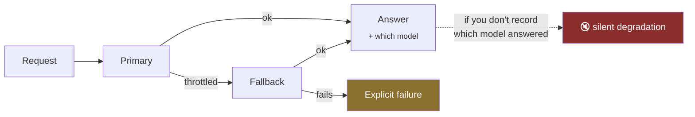

# PROD-02 · Failover that cannot be silent

`production` · **medium** · 30 min · prereq [AGL-03](../../agent-loop/AGL-03/)

---

## L — Learn

Failover is the feature most likely to hurt you *while working exactly as designed*.

The primary model throttles. You fall back to a smaller one. Requests keep succeeding, latency looks fine,
the error rate stays at zero — and answer quality drops for six weeks until someone escalates a complaint.



An outage is loud and gets fixed in an hour. Degradation is quiet and ships to customers.

### The decision you have to make

> **Which failures are worth retrying, and which should fail immediately?**

Retrying a throttle is sensible — capacity comes back. Retrying a validation error is not: the request is
malformed and will be malformed on the fallback too, so you have doubled the latency and the cost to
produce the same failure.

Classify your errors before you write the retry.

---

## A — Apply

Implement `invoke_with_failover(request, models, classify_error)`.

- `models` — an ordered list of `{"id": str, "call": callable}`; index 0 is primary
- `classify_error(exc) -> "retryable" | "fatal"` — provided

**Return**

```python
{"response": ...,          # whatever the successful model returned
 "model_id": str,          # WHICH model answered — the whole point
 "attempts": [{"model_id": str, "outcome": "ok"|"retryable"|"fatal", "error": str|None}],
 "degraded": bool,         # True when anything other than the primary answered
 "failed": bool}
```

**Requirements**

1. Try models in order. Stop at the first success.
2. `model_id` always names the model that actually produced the response.
3. `degraded` is `True` whenever the answering model is not `models[0]`.
4. A **fatal** error stops the chain immediately — do not try the fallback.
5. Every attempt is recorded in `attempts`, in order, including the successful one.
6. If every model fails: `failed=True`, `response=None`, and `attempts` explains the whole chain.
7. Never raise. A failed chain is a return value.

> Requirement 3 is the entire lab. Everything else is plumbing around one boolean that makes a silent
> failure observable.

---

## B — Break

```bash
python labs/runner/labctl.py break PROD-02
```

A fatal error on the primary. Every model down. A model that raises something unclassifiable. An empty
model list. Each is a state a real deploy reaches on a bad afternoon.

**Field guide:** [Silent Degradation Watchlist](../../../../cheatsheets/frameworks/silent-degradation-watchlist.md) ·
[Observability](../../../../cheatsheets/quick-reference/observability.md)
