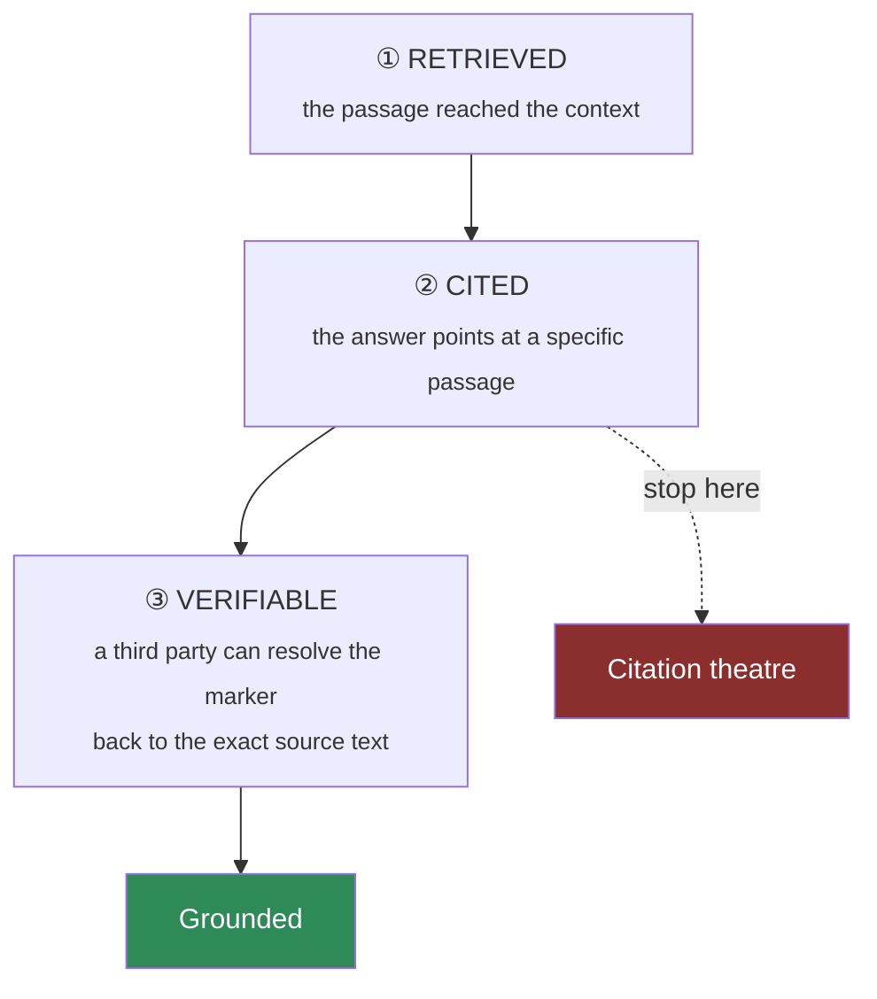

# RET-05 · Citations that survive verification

`retrieval` · **medium** · 35 min · prereq [TOOL-03](../../tools/TOOL-03/)

---

## L — Learn

Most "add citations to RAG" exercises stop at formatting: put `[1]` in front of each chunk, join with
blank lines, done. That produces a string that *looks* cited and proves nothing.

A citation is a **claim about provenance**. Three separate things have to be true, and formatting is only
the first:



Step ③ is what almost nobody builds. If your context block renders `[1]` but you keep no mapping from
`1` back to `fare-rules§7.3`, then when the model writes "refundable [1]" nobody — not your evaluator, not
your auditor, not the ops agent reading it — can check whether passage 1 actually says that. You have
produced a citation that cannot be wrong, which is the same as a citation that cannot be right.

### The decision you have to make

> **A chunk arrives with no `source_id`. What do you do?**

| Option | Consequence |
| --- | --- |
| Include it, unnumbered | The model uses it and cites nothing. Ungrounded text enters the answer |
| Include it with a marker anyway | You have invented provenance. Worse than nothing |
| **Exclude it, and record the exclusion** | Smaller context, and you can explain the gap |

Only the third survives an audit. Decide, and note what it costs you.

---

## A — Apply

Implement `build_context(chunks)` where each chunk is `{"text": str, "source_id": str}`.

**Return** a dict — not a string. A string cannot carry the mapping.

```python
{"context": str,          # what goes in the prompt
 "citations": {1: "fare-rules#7.3", 2: "refund-policy#2.1"},   # marker -> source
 "excluded": [{"reason": "missing source_id", "text_preview": "…"}],
 "chunk_count": int}
```

**Requirements**

1. Markers are `[1]`, `[2]`, … assigned in order of appearance, starting at 1.
2. The marker goes immediately before the chunk's text; chunks are separated by a blank line (`\n\n`).
3. **`source_id` must never appear in `context`.** The model must cite the number, not the path — the
   number is what your verifier resolves.
4. `citations` maps every marker used in `context` back to its `source_id`. Nothing else.
5. A chunk with a missing, empty, or non-string `source_id` is **excluded**, and appears in `excluded`
   with a reason. It gets no marker and its text never reaches `context`.
6. Two chunks from the **same** `source_id` get **different** markers. They are different passages; a
   verifier resolves each independently.
7. If every chunk is excluded, `context` is `""` and `citations` is `{}` — the caller must be able to
   detect "nothing usable" without parsing the string.

```bash
python labs/runner/labctl.py start RET-05
python labs/runner/labctl.py run   RET-05
```

---

## B — Break

```bash
python labs/runner/labctl.py break RET-05
```

The Break phase runs a **verifier** over your output: it takes an answer containing markers and tries to
resolve every one back to source text. Chunks arrive with duplicated ids, markers embedded in the chunk
text itself, and text containing `[1]` naturally. If your mapping is ambiguous, the verifier says so.

---

## What a pass proves

Your context block supports an *automated* grounding check — which is what turns "we have citations" from
a claim into evidence. This is the difference between [E2 and E4](../../../../cheatsheets/frameworks/evidence-ladder.md).

**Field guide:** [Grounding Triangle](../../../../cheatsheets/frameworks/grounding-triangle.md) ·
[Evidence Ladder](../../../../cheatsheets/frameworks/evidence-ladder.md) ·
[RAG pipeline](../../../../cheatsheets/quick-reference/rag-pipeline.md)
