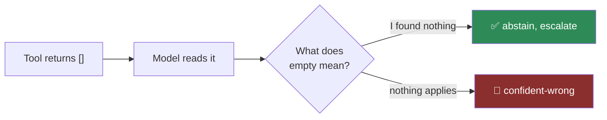

# TOOL-03 · Fail honestly: no bare empties

`tools` · **medium** · 25 min · prereq [AGL-01](../../agent-loop/AGL-01/)

---

## L — Learn

Here is a bug that ships to production constantly, passes every test, and raises no error.

A policy search finds nothing and returns `[]`. The model reads that and writes:

> "There are no restrictions on refunds for this fare."

The tool meant **"I found no matching policy."** The model heard **"no policy applies."** Those are
opposite claims, and the second one is a confident, fluent, entirely invented answer that will be acted on.



An exception is *safer* than an empty list, because an exception cannot be misread as an answer. The
dangerous returns are the ones that look like data.

### The decision you have to make

> **Your tool has three distinct outcomes: found something, found nothing, could not look. How does the
> return value make all three unmistakable?**

The model only sees what you hand it. If "found nothing" and "could not look" serialise to the same JSON,
no prompt engineering downstream can recover the difference.

---

## A — Apply

Implement `search_policy(query, corpus, index_status="ready")`.

`corpus` is a list of `{"id": str, "text": str}`. A passage matches if every whitespace-separated term in
`query` appears in its text, case-insensitively.

**Return a dict that always carries an explicit `status`:**

| Situation | `status` | Also include |
| --- | --- | --- |
| Matches found | `"ok"` | `matches`: list of `{id, text}` |
| No passage matched | `"no_matches"` | `query`, `searched_count`, and `advice` |
| `index_status != "ready"` | `"unavailable"` | `reason`, and `advice` |
| `query` is empty/whitespace | `"invalid_query"` | `advice` |

**Requirements**

1. `status` is always present and is one of the four above.
2. **`no_matches` and `unavailable` must never be confusable.** One means the corpus was searched and
   held nothing; the other means it was not searched.
3. Every non-`ok` result carries `advice`, and the advice must do **two** things: forbid the wrong
   conclusion explicitly ("do not conclude that…"), and name the next action ("say you could not check
   and escalate"). A sentence that only reports the absence still leaves the model to interpret it — and
   it interprets absence as permission.
4. Never return a bare `[]`, `{}`, `None`, or raise for these four cases.
5. `matches` preserves corpus order.

> Requirement 3 is the one that does the work. `{"status": "no_matches"}` is honest but passive; the model
> still has to decide what that means. `"advice": "Do not state that no policy applies — say you could not
> find one and escalate."` removes the decision.

---

## B — Break

```bash
python labs/runner/labctl.py break TOOL-03
```

The Break phase does not test your search. It tests whether a **downstream consumer** can tell your four
outcomes apart without reading prose — because that is what a real agent has to do.

---

## What a pass proves

Your tools cannot be misread. This is the single highest-leverage change available to most agent
codebases, and it is entirely in the return contract.

**Field guide:** [Tool Surface Audit](../../../../cheatsheets/frameworks/tool-surface-audit.md) ·
[Grounding Triangle](../../../../cheatsheets/frameworks/grounding-triangle.md) ·
[Failure Signature Catalog](../../../../cheatsheets/frameworks/failure-signature-catalog.md) row 13
